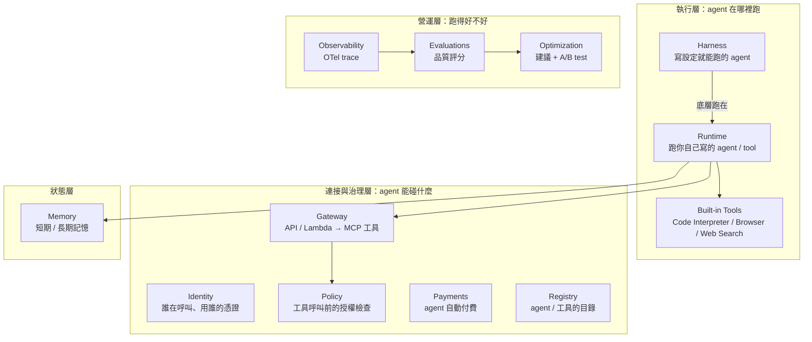
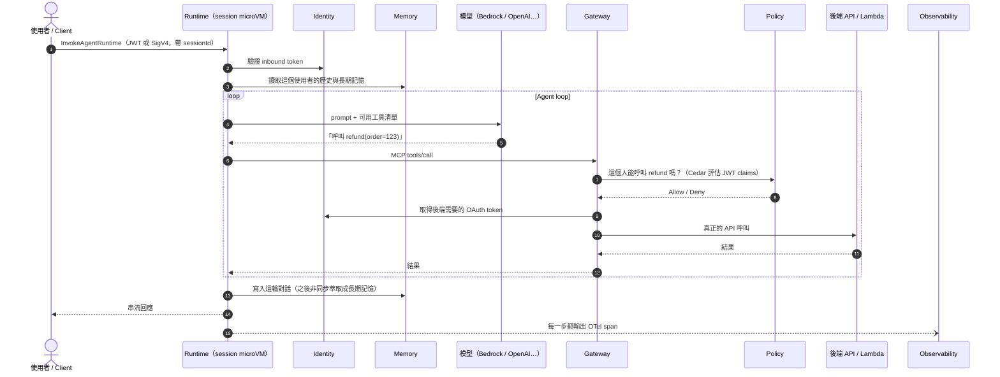

# 總覽：AgentCore 整體架構

> 各元件怎麼組在一起、計費模式、區域與配額，以及跟 Bedrock Agents（Classic）的關係。
>
> 資料查核日期：2026-09-30。AgentCore 更新很快，數字以官方文件為準。

## TL;DR

- AgentCore 是 AWS 為「AI agent」提供的**一組託管基礎設施服務**，定位類似 agent 專用的 Lambda/ECS，再加上 Cognito、API Gateway、CloudWatch 這類周邊服務的組合包。
- **模型和框架都不綁定**：可以用 Bedrock 上的模型，也可以用 OpenAI、Gemini；可以用 LangGraph、Strands，也可以自己寫迴圈。
- 各元件**可以單獨使用**。例如只用 Memory，agent 本身跑在自己的 EKS 上也沒問題。
- 最關鍵的一個選擇：**Harness（寫設定，AWS 幫你跑 agent 迴圈）** 還是 **Runtime（自己寫程式碼，AWS 只負責執行環境）**，詳見[下方比較](#harness-vs-runtime最重要的一個選擇)。
- 舊的 Bedrock Agents 自 2026-07-30 起更名為 **Bedrock Agents Classic** 並進入維護模式，新帳號已經無法建立，官方建議改用 AgentCore。

## 先對齊幾個 AI 名詞

以下只列看懂後面內容需要的名詞，並盡量用後端工程的概念來類比。

| 名詞 | 白話解釋 | 類比 |
|------|----------|------|
| **Foundation model / LLM** | 大型語言模型，例如 Claude、GPT。輸入文字，輸出文字。 | 一個很聰明、但**無狀態**、**不保證輸出一致**的外部 API |
| **Token** | 模型計量用的單位，大約是 0.75 個英文單字或 1–2 個中文字。模型費用按 token 計。 | 類似流量計費的 byte |
| **Agent** | 讓 LLM 在一個迴圈裡**自己決定下一步**：要呼叫哪個工具、拿到結果後要再做什麼，直到完成任務。 | 一個 worker，它的控制流程是由 LLM 在執行期決定的，而不是寫死在程式碼裡 |
| **Agent loop / 編排迴圈** | 「呼叫模型 → 模型說要用工具 X → 執行 X → 把結果餵回模型 → …」這個循環 | 本質上就是 `while (!done) { ... }` |
| **Harness** | 包在 agent loop 外面、讓它能在正式環境跑起來的那層：運算資源、沙箱、檔案系統、記憶、身分、監控 | 類似 application server 之於你的 handler |
| **Tool** | 開放給 agent 呼叫的函式或 API，要附上名稱、說明和參數 schema，模型靠這些資訊判斷何時該用 | 帶有 OpenAPI 描述的 endpoint |
| **MCP**（Model Context Protocol） | 一個開放標準，規範 agent 怎麼「列出工具」與「呼叫工具」 | 工具界的 USB 介面；或者想成 LSP 之於編輯器 |
| **A2A**（Agent-to-Agent） | 規範 agent 之間怎麼互相發現、互相呼叫的協定 | 服務之間的 RPC 協定 |
| **Session** | 一段連續的對話或任務，裡面會有多輪互動 | 等同 web session |
| **LLM-as-a-judge** | 請另一個 LLM 依照評分標準幫 agent 的輸出打分數 | 自動化的 code review 評分員 |

## 元件地圖

官方目前列出 **12 個元件**。依職責可以分成四層：

| 元件 | 做什麼 | 用熟悉的東西類比 | 本 repo 對應 |
|------|--------|------------------|--------------|
| Harness | 宣告模型、system prompt、工具，AWS 幫你跑 agent loop | Heroku 之類的 PaaS，給設定就能跑 | 無（見下方〈目錄缺口〉） |
| Runtime | Serverless 執行 agent 或 tool 的程式碼，每個 session 一台 microVM | Lambda + Fargate 的綜合體，但 session 最長可活 8 小時 | [01](../01-runtime/) |
| Memory | 對話歷史（短期）與萃取後的長期知識 | Redis session store + 自動整理的使用者 profile DB | [02](../02-memory/) |
| Gateway | 把 REST API、Lambda、既有 MCP server 統一包成 MCP 工具端點 | 專給 agent 用的 API Gateway | [03](../03-gateway/) |
| Identity | 驗證呼叫 agent 的人（inbound），並代管 agent 對外要用的 OAuth token 或 API key（outbound） | Cognito + Secrets Manager + OAuth token vault | [04](../04-identity/) |
| Code Interpreter / Browser / Web Search | 代管的沙箱：執行程式碼、操作無頭瀏覽器、搜尋網路 | 用完即丟的 sandbox container / 雲端 Playwright | [05](../05-built-in-tools/) |
| Observability | 把 agent 每一步輸出成 OpenTelemetry trace，送進 CloudWatch | X-Ray，但 span 是「模型呼叫」「工具呼叫」 | [06](../06-observability/) |
| Evaluations | 對 trace 自動評分，例如任務有沒有完成、有沒有答非所問 | 跑在正式流量上的自動化測試與品質監控 | [07](../07-evaluations/) |
| Policy | 每次工具呼叫前，用 Cedar policy 做確定性的允許或拒絕判斷 | IAM policy / OPA，但套用在「agent 想呼叫某工具」這個動作上 | [08](../08-policy/) |
| Payments | 遇到收費 API 回 HTTP 402 時，自動付款後重試，有預算上限 | 帶額度上限的公司信用卡 | [09](../09-payments/) |
| Optimization | 讀取 trace，產生 prompt／工具描述的修改建議，並用 A/B test 驗證 | 內建 feature flag 與 A/B 的調參服務 | 無 |
| Registry | 組織內 agent、MCP server、skill 的目錄，附審核流程與搜尋 | 內部的 service catalog（例如 Backstage） | 無 |

### 為什麼 agent 需要這些，不能直接丟到 Lambda？

Agent 的工作負載有幾個特性，一般的 serverless 服務處理起來會很吃力：

1. **執行時間長、大部分時間在等**：一次任務可能要呼叫十幾次模型，每次好幾秒，總長從數分鐘到數小時都有，但 CPU 大多閒著。Lambda 最長只能跑 15 分鐘，而且等待的時間一樣計費。
2. **有狀態**：多輪對話需要在同一個環境裡累積上下文和檔案。
3. **行為不確定**：同樣的輸入不保證同樣的輸出，而且 agent 可能執行它自己產生的程式碼。所以要做到**每個 session 硬隔離**（microVM），出事時影響範圍也比較好控制。
4. **一定會碰到外部系統**：要代替使用者去存取 Slack、GitHub 等服務，憑證管理和授權就成了核心問題，不能只是附加功能。

AgentCore 的元件大致就是對著這四點設計的。

## 一個請求怎麼走

以「使用者請客服 agent 幫忙查訂單並退款」為例（Runtime 模式）：

幾個重點：

- **Policy 掛在 Gateway 上**，不是掛在 agent 上。也就是說授權發生在「工具被呼叫之前」，並且**由確定性的程式規則決定，不交給 LLM 判斷**，就算模型被 prompt injection（用惡意輸入誘騙模型）騙了，也繞不過這道檢查。
- **模型呼叫不經過 AgentCore**：agent 自己去呼叫模型供應商，模型費用也另外計算。
- Harness 模式的流程相同，差別只是圖中「Runtime 裡的 agent loop」改由 AWS 提供。

## Harness vs Runtime：最重要的一個選擇

|  | Harness | Runtime |
|--|---------|---------|
| Agent loop 由誰寫 | AWS 提供（底層是 Strands Agents） | 你自己寫（任何框架，或不用框架） |
| 怎麼定義 agent | 設定檔：model、system prompt、tools、memory、limits | 程式碼 + `BedrockAgentCoreApp` entrypoint，打包成 ARM64 container 或 zip |
| 接 Memory / Gateway / Browser / outbound 憑證 | 一個設定欄位 | 自己在程式碼裡呼叫 SDK |
| 換模型供應商 | 改設定即可，甚至可以在同一個 session 中途切換 | 自己實作 |
| 不支援或較難的情境 | 選擇框架、雙向串流、graph/workflow 式編排、複雜的多 agent 協作 | 都能做，但都要自己寫 |
| 額外費用 | 無，只付底層用到的資源 | 無 |
| 關係 | **Harness 底層跑在 Runtime 上**，配額也共用 Runtime 的 | — |

官方建議：**先用 Harness，只有在有明確理由時才自己掌控 loop**，例如已經有既有的 agent 程式碼要搬過來，或是需要 Harness 表達不了的編排方式。Harness 也可以匯出成 Strands 程式碼，之後改用 Runtime 部署，所以不算單向綁定。

## 控制面與資料面、開發介面

跟大多數 AWS 服務一樣分成兩組 API：

- **Control plane**（`bedrock-agentcore-control`）：建立、更新 Runtime、Memory、Gateway 等資源。
- **Data plane**（`bedrock-agentcore`）：執行期的操作，例如 `InvokeAgentRuntime`、寫入 memory event。

| 介面 | 用途 |
|------|------|
| AgentCore CLI（Node.js，`@aws/agentcore`） | 官方主推的開發流程：`create` / `dev` / `deploy` / `invoke`。底層用 CDK 佈建資源 |
| AgentCore Python SDK | 寫 agent 時用的 wrapper（Runtime entrypoint、Memory、Tools、Identity、Evaluations） |
| AWS SDK / AWS CLI | 完整 API；非 Python 語言都走這條 |
| AgentCore MCP server | 讓 Claude Code、Cursor 等 coding assistant 直接操作 AgentCore |
| Console | 管理資源，也有 agent sandbox 可以直接測試 |

## 計費模型

全部按用量計費，沒有最低消費。以下是美國區牌價（2026-09 查詢）：

| 元件 | 計費單位 | 價格 | 值得注意的地方 |
|------|----------|------|----------------|
| Runtime（microVM v1） | vCPU-hour / GB-hour | $0.0895 / $0.00945 | **等待 I/O 的時間不收 CPU 費用**，按秒計、最少 1 秒 |
| Runtime（microVM v2） | 同上 | $0.1276 / $0.0169 | 單價較高，但閒置 120 秒後會回收記憶體；2026-10 起有 committed baseline 價 |
| Runtime（Instances） | EC2 費用 + 管理費 | EC2 On-Demand 價的 12%（GPU 機型 7.8%） | 用自己帳號的 EC2 跑，session 最長 14 天 |
| Harness | — | 不另外收費 | 只付底層 Runtime 等資源 |
| Code Interpreter / Browser | vCPU-hour / GB-hour | 同 Runtime v1 | |
| Web Search | 每千次查詢 | $7.00 | 相較之下偏貴 |
| Gateway | 每千次呼叫 | InvokeTool / ListTools $0.005；Search $0.025 | 另收工具索引費：每月每 100 個工具 $0.02 |
| Identity | 每千次 token / API key 請求 | $0.010 | **透過 Runtime 或 Gateway 使用時免費** |
| Memory | 事件 / 記錄 / 檢索 | 短期：每千個事件 $0.25 長期儲存：每千筆記錄每月 $0.75 長期檢索：每千次 $0.50 | |
| Observability | 轉由 CloudWatch 計費 | 依 CloudWatch 價格 | |
| Evaluations | token 或次數 | 內建評估器：每千個 input token $0.0024 | 自訂評估器每千次 $1.50，模型費用另計 |
| Policy | 每次授權檢查 | $0.000025 | 每百萬次 $25 |
| Payments | 錢包供應商計費 | Coinbase CDP：每次操作 $0.005 | AWS 本身不另外收費 |
| Registry / Optimization | — | 有免費額度；Optimization 預覽期間免費 | |

**成本直覺：** 以一個 session 為例，1 vCPU 實際運算 60 秒、2 GB 記憶體維持 5 分鐘，用 v1 價格自行試算：CPU 約 $0.0015 + 記憶體約 $0.0016 ≈ **每個 session $0.003**。但 session 呼叫完後會**閒置到逾時（預設 15 分鐘）才結束，這段期間記憶體照算**：最小 agent 含 15 分鐘閒置實測約 $0.003 / 個（[WP0 #3](../91-work-packages/WP0-cost-baseline.md#回填)），金額 92% 來自記憶體（[WP1 #10](../91-work-packages/WP1-runtime-session.md#10-成本情境)）。方案 B（AgentCore Runtime 跑自寫 agent）實測每位使用者每月基礎設施約 $2.53–2.84（[WP5 #8](../91-work-packages/WP5-user-state-isolation.md#回填)），模型 token 費 Haiku 4.5 約 $0.9–1.4、Sonnet 4.6 約 $2.9–3.4（[WP5](../91-work-packages/WP5-user-state-isolation.md#模型-token-費補2026-10-05)，不含在 AgentCore 帳單裡），**兩者同一個量級，模型費不一定是大宗**；只有方案 A（OpenClaw 跑在 AgentCore）因為每輪送約 2.6 萬個輸入 token，模型費佔 94%（[WP7 #4](../91-work-packages/WP7-openclaw-on-agentcore.md#回填)）。所以考慮 AgentCore 的成本時，要壓低 session 閒置的時間（縮短閒置逾時或用完主動 `StopRuntimeSession`），也要注意 Web Search、Evaluations 這類按次或按 token 計費的項目，以及 CloudWatch 的日誌量。

## 區域可用性

| 元件 | 東京 | 新加坡 | 雪梨 | 首爾 | 孟買 |
|------|:---:|:---:|:---:|:---:|:---:|
| Runtime microVM / Gateway / Identity / Built-in Tools / Observability / Policy / Evaluations / Optimization | ✓ | ✓ | ✓ | ✓ | ✓ |
| Harness / Memory | ✓ | ✓ | ✓ | ✓ | ✓ |
| Runtime Instances | ✓ | ✓ | ✓ | ✗ | ✓ |
| Runtime **V2** 平台 | ✓ | ✗ | ✗ | ✗ | ✗ |
| Payments | ✗ | ✓ | ✓ | ✗ | ✗ |
| Registry | ✓ | ✗ | ✓ | ✗ | ✗ |
| Web Search Tool | ✓ | ✗ | ✗ | ✗ | ✗ |

- **沒有台灣區**。從台灣出發，**東京（`ap-northeast-1`）是元件最齊的亞太區**，唯一缺的是 Payments。
- 美國的 `us-east-1` 與 `us-west-2` 功能最完整，配額也最高。
- ⚠️ Web Search 的可用區域，官方文件前後不一致：區域表寫 us-east-1、愛爾蘭、東京，Harness 的 Tools 頁卻寫「只有 us-east-1」。

## 值得先知道的配額

完整清單見官方 Quotas 頁面，這裡只列會影響架構設計的：

| 項目 | 預設值 | 可否調整 | 影響 |
|------|--------|:---:|------|
| 單一 session 的硬體上限 | 2 vCPU / 8 GB | ✗ | 重運算的工作要拆出去做 |
| Session 最長存活時間 / 閒置逾時 | 8 小時 / 15 分鐘 | ✓（`LifecycleConfiguration`） | Session 狀態是暫時的，要長期保存的東西得寫進 Memory 或 S3 |
| 同步請求逾時 | 15 分鐘 | ✗ | 更長的工作要走非同步模式 |
| **新 session 建立速率** | **25 TPS / 帳號** | ✓ | 流量尖峰時最容易先碰到的上限 |
| 同時存在的 session 數 | us-east-1、us-west-2：5,000；其他區：2,500 | ✓ | |
| Container image 大小 | 2 GB | ✗ | |
| Gateway 工具呼叫速率 | 200 TPS（每個 gateway 和整個帳號都是） | ✓ | |

## 跟 Bedrock Agents（Classic）的關係

- **Bedrock Agents**（2023-11 推出）是「在 console 裡設定就能用」的全託管 agent。2026-07-30 起更名為 **Bedrock Agents Classic**，進入維護模式：
  - 過去 12 個月有使用紀錄的帳號可以繼續用；**沒有紀錄的帳號呼叫 `CreateAgent` 會收到 403，而且沒有例外申請管道**。
  - 模型清單凍結在 2026-07-30，之後推出的新模型只會出現在 AgentCore。
  - 目前沒有公布終止服務的日期，也沒有強制遷移的期限。
  - Bedrock 本身，包括模型推論、Knowledge Bases、Guardrails，都**不受影響**。
- 遷移時的概念對應：

| Classic | AgentCore |
|---------|-----------|
| 託管的 orchestration | Harness |
| Action groups（OpenAPI + Lambda） | Gateway 包成的 MCP 工具 |
| 直接掛上 Knowledge Base | 透過 Gateway 或 retrieval 工具存取 |
| Prompt override（各階段） | **只有整體的 system prompt**，無法逐階段覆寫 |
| Multi-agent collaboration | Harness 只支援 agent-as-tool；複雜的協作要改用 Runtime 自己寫 |
| Return of control | Harness 的 inline function tools |

- 官方提供了遷移工具：[agent toolkit for AWS](https://github.com/aws/agent-toolkit-for-aws) 裡的 `amazon-bedrock` skill，可以讓 coding assistant 協助完成遷移。
- 另外還有 **Bedrock Managed Agents（with OpenAI，預覽中）**：由 AWS 執行 OpenAI Codex 的 harness，需要執行指令時交給你帳號裡的 AgentCore Runtime 處理。~~當初標註「尚未在官方文件中確認」~~，後續已在官方文件中確認，細節見 [90](../90-integrations/README.md#延伸bedrock-managed-agentswith-openai預覽中)。

## 目錄缺口

官方元件清單中，有三個**沒有獨立的資料夾**，分別併入以下篇章：

- **Harness**：見本篇的[延伸：Harness 與 Runtime 的選擇細節](harness-vs-runtime.md)。
- **Optimization**：併入 [07-evaluations](../07-evaluations/README.md#optimization從評估結果到改善)。
- **Registry**：併入 [03-gateway](../03-gateway/README.md#aws-agent-registry組織層級的目錄)。

## 延伸調研

- [Harness 與 Runtime 的選擇細節](harness-vs-runtime.md)：能力邊界、逃生口、踩雷清單、export 路徑
- [自建 vs 用 AgentCore](build-vs-buy.md)：各元件自建難度、綁定程度分析、混合策略。其中的難度與成本已依 [WP6](../91-work-packages/WP6-oss-alternatives.md#回填) 的實測與官網價格更正（見 WP6 A 半、B 半的「要更正研究庫的段落」）

## 研究問題

- [x] 各元件的職責與相依關係（畫一張架構圖）
- [x] 典型 request flow：User → Runtime → Gateway → Policy → Backend
- [x] 計費模式與成本結構
- [x] 區域可用性與配額限制
- [x] 與舊版 Bedrock Agents 的差異與定位

## 參考資料

- [What is Amazon Bedrock AgentCore?](https://docs.aws.amazon.com/bedrock-agentcore/latest/devguide/what-is-bedrock-agentcore.html)
- [AgentCore harness](https://docs.aws.amazon.com/bedrock-agentcore/latest/devguide/harness.html)、[Harness vs. Runtime](https://docs.aws.amazon.com/bedrock-agentcore/latest/devguide/harness-vs-runtime.html)
- [Runtime：How it works](https://docs.aws.amazon.com/bedrock-agentcore/latest/devguide/runtime-how-it-works.html)
- [Available interfaces](https://docs.aws.amazon.com/bedrock-agentcore/latest/devguide/develop-agents.html)
- [AgentCore pricing](https://aws.amazon.com/bedrock/agentcore/pricing/)
- [Supported AWS Regions](https://docs.aws.amazon.com/bedrock-agentcore/latest/devguide/agentcore-regions.html)
- [Quotas](https://docs.aws.amazon.com/bedrock-agentcore/latest/devguide/bedrock-agentcore-limits.html)
- [Bedrock Agents Classic maintenance mode](https://docs.aws.amazon.com/bedrock/latest/userguide/agents-classic-maintenance-mode.html)
- [awslabs/agentcore-samples](https://github.com/awslabs/agentcore-samples)

## 延伸調研方向

範圍限於 00：

1. **完整月成本試算：** 以每月 10 萬個 session 的客服情境，加總 AgentCore 各項費用與模型 token 費用，看 AgentCore 本身佔多少比例。
2. **Harness 的安全模型：** agent 擁有 root shell 時，IAM、`allowedTools`、VPC、hooks 怎麼組成縱深防禦，以及官方把哪些責任劃給使用者（shared responsibility）。
3. **從 Bedrock Agents Classic 遷移的實際路徑：** 自動遷移 skill 會檢查什麼、哪些功能無法直接對應（分階段的 prompt override、依路由分派的多 agent 協作），以及各自的替代寫法。
