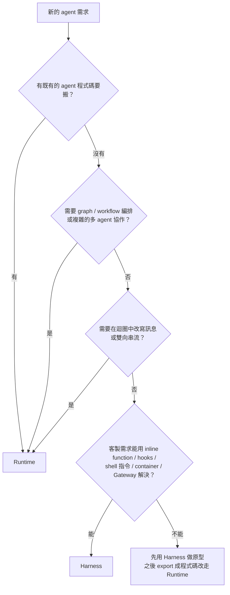

# 延伸：Harness 與 Runtime 的選擇細節

> 接續 [總覽](README.md#harness-vs-runtime最重要的一個選擇)。這篇回答三個問題：Harness 實際能做到哪裡？什麼情況一定得改用 Runtime？從 Harness「畢業」的路徑順不順？
>
> 資料查核日期：2026-09-30

## 結論先講

- Harness 的能力比「寫設定檔就能跑」這個印象廣很多：它有 **5 種工具接法、Lambda 攔截點（hooks）、直接下 shell 指令的 API、自訂 container**，大多數客製需求都能在不離開 Harness 的前提下解決。
- **真正的硬邊界只有一種：你需要改變 agent loop 本身的行為。** 例如選用其他框架、graph/workflow 式編排、複雜的多 agent 協作、在迴圈中改寫訊息內容，或是雙向串流。
- **畢業路徑是單向、但還算順：** `agentcore export harness` 會產生一份 Strands（Python）程式碼，可以部署到 Runtime，**也可以部署到任何能跑 Python 3.12+ 的地方**（Lambda、ECS、K8s、自有機房）。這點會直接影響[綁定程度](build-vs-buy.md#綁定程度分析)的評估。

## Harness 的心智模型：建立時給預設值，呼叫時可覆寫

用 `CreateHarness` 建立時給一組預設值（model、system prompt、tools、memory、limits），**每次 `InvokeHarness` 呼叫都能覆寫其中大部分，而不需要重新部署**。可以在呼叫時覆寫的項目：

`model`、`tools`、`systemPrompt`、`maxIterations`、`maxTokens`、`timeoutSeconds`、`skills`、`allowedTools`、`actorId`

這個設計的用意是**讓 prompt 和模型的實驗成本趨近於零**：同一個 session 裡，這一輪用 Claude、下一輪換成 GPT，對話上下文也會自動延續。

> 💡 為什麼換模型這麼重要？在 AI 應用中，「哪個模型 × 哪段 prompt」的組合對品質和成本影響很大，而且只能靠實測決定，性質上接近調整 DB index，差別在於沒有 EXPLAIN 可以看。

## 能力清單

### 工具（Tools）：5 種接法，外加 2 個內建工具

| 類型 | 說明 | 什麼時候用 |
|------|------|-----------|
| `remote_mcp` | 直接填入 MCP server 的 URL；header 可以引用 Identity token vault 的 ARN（`${arn:...}`），執行時才換成實際的 key。每次 `InvokeHarness` 覆寫 `tools` 就能帶不同使用者的 header（[WP2](../91-work-packages/WP2-capability-boundary.md) #4 實證） | 簡單接一個現成的 MCP server |
| `agentcore_gateway` | 填入 Gateway ARN，這個 gateway 底下的所有工具都會變成可用 | 需要治理：驗證、Policy、OAuth 憑證輪替 |
| `agentcore_browser` | 代管的瀏覽器 | 需要操作網頁 |
| `agentcore_code_interpreter` | 代管的程式碼沙箱（Python / JS / TS） | 資料分析、計算 |
| `inline_function` | **只定義 schema，實際在呼叫端執行**（見下方〈逃生口〉） | 需要人工核准，或要呼叫內部 API |
| 內建 `shell`、`file_operations` | 每個 session 預設就有：bash 指令與檔案讀寫 | 讓 agent 能寫程式、執行程式 |

`allowedTools` 支援 glob 語法（例如 `@git/read_*`、`@builtin`），可以限制模型能看到哪些工具。[WP2](../91-work-packages/WP2-capability-boundary.md) #5 實證：呼叫時覆寫後，模型不知道被排除的工具；`remote_mcp` 的工具寫成 `@<server 名>/<工具名>`。

### 其他能力

| 能力 | 重點 |
|------|------|
| **Skills** | 採用開放的 [AgentSkills.io](https://agentskills.io/specification) 格式（`SKILL.md` + scripts）。一開始只把約 100 token 的摘要放進 system prompt，真正要用時才載入完整內容。來源可以是 AWS 官方技能庫、Git、S3，或 container 內的路徑 |
| **Memory** | 短期記憶（對話事件）+ 長期記憶（4 種萃取策略：semantic、summarization、user preference、episodic）。用 `actorId` 做使用者隔離 |
| **Context 截斷** | 對話超過模型的上下文長度時：`sliding_window`（預設，保留最近 N 則）或 `summarization`（把舊訊息壓縮成摘要） |
| **執行環境** | 預設只有 Python + bash；可以換成自己的 container（`linux/arm64`） |
| **檔案系統** | Session storage（同一個 session ID 停止再恢復後仍保留），或掛載 EFS / S3 Files（需要 VPC，可跨 session 共享） |
| **執行上限** | `maxIterations`（預設 75）、`timeoutSeconds`（預設 3600）、`maxTokens`（**預設無上限**）、閒置 900 秒、最長存活 28800 秒（8 小時） |
| **版本與 endpoint** | 版本不可變更，endpoint 有名稱；回滾時只要把 endpoint 指回舊版本 |
| **Guardrails** | 可以在 `additionalParams` 裡掛上 Bedrock Guardrails（過濾有害內容），僅限 `converse_stream` 格式 |

## 逃生口：不離開 Harness 也能做的客製化

遇到「Harness 好像做不到」的情況時，先檢查下面四個機制：

### 1. Inline function：把工具的執行權交回呼叫端

```
Client ──InvokeHarness──▶ Harness ──▶ 模型決定呼叫 approve_purchase(item, amount)
Client ◀── stream 結束，stopReason = "tool_use" ──┘
Client：自己執行（例如跳出核准視窗給主管按）
Client ──InvokeHarness(同一個 sessionId, toolResult)──▶ Harness 從 session 狀態接著跑
```

- 這就是 Bedrock Agents Classic 裡的 **return of control**。適合用在人工核准（human-in-the-loop），或是呼叫 Harness 連不到的內網 API。
- 同一個回應裡如果有多個工具呼叫，會**依序**執行；inline 的工具一次只交回一個。

### 2. Lifecycle hooks：在迴圈的四個點插入檢查

| 事件 | 觸發時機 | Lambda 回傳 `deny` 的效果 |
|------|---------|--------------------------|
| `before_invocation` | 呼叫開始、還原 session 狀態之前 | 整次呼叫停止 |
| `before_tool_call` | 模型決定呼叫工具、實際執行之前 | **跳過這個工具**，迴圈繼續 |
| `after_tool_call` | 工具執行完畢 | 保留結果，但整次呼叫停止 |
| `after_invocation` | 呼叫結束（附帶 token 用量） | 只會回報，無法撤回已經串流出去的內容 |

- 目標可以是 Lambda（同步執行，**唯一能改變流程的類型**）、SNS 或 EventBridge（非同步，只做通知）。
- 每個 harness 最多 20 個 hook；同一個事件上的多個 Lambda 會平行執行，**只要有一個 deny 就算 deny**。
- **限制：hook 只能回傳 allow 或 deny，不能改寫內容。** 想在迴圈中修改工具的輸入或模型的訊息，Harness 做不到。這是最常把人推向 Runtime 的原因之一。

### 3. `InvokeAgentRuntimeCommand`：直接在 microVM 上執行 shell 指令

- 不經過模型，**結果是確定的、不花 token**。常見用途：呼叫 agent 之前先 `git clone` 或安裝相依套件；agent 做完之後跑測試、取出產物。
- 等於在 agent 前後各接一段確定性的腳本，**agent 負責需要判斷的部分，腳本負責固定流程**。這種模式很適合 coding agent 類的應用。

### 4. 自訂 container 與 Gateway

- 需要特定工具鏈時（node、git、公司內部的 CLI），做成 container image 就好。
- 需要複雜的工具邏輯時，寫成 Lambda 放到 Gateway 後面，Harness 只看得到一個 MCP 工具。**工具的複雜度可以放在 Harness 外面，不影響 Harness 本身。**

## 硬邊界：出現這些需求就該改用 Runtime

| 需求 | 為什麼 Harness 做不到 |
|------|----------------------|
| 指定特定框架（LangGraph、CrewAI、Claude Agent SDK…） | Harness 固定使用 Strands |
| Graph / workflow 式編排（固定的步驟 A → B → C，或是有條件分支的狀態機） | Harness 只有一種「模型自己決定下一步」的迴圈 |
| 複雜的多 agent 協作（依路由分派、多個 agent 輪流處理） | 只支援 agent-as-tool：把另一個 agent 包成工具來呼叫 |
| 在迴圈中改寫訊息或工具輸入（middleware） | Hook 只能 allow / deny |
| 針對不同階段設定不同 prompt（例如前處理用一段、生成回應用另一段） | 只有一個整體的 system prompt |
| 雙向串流（例如即時語音對話） | 不支援 |

### 決策流程



## 踩雷清單

1. **Memory 的預設值依建立方式而不同：** 直接呼叫 API 建立時，**預設會開啟 managed memory**（會持續產生 Memory 費用）；用 AgentCore CLI 建立時，**預設是關閉的**。另外，刪除 harness 時**預設會連同 managed memory 一起刪除**，要保留的話必須帶 `deleteManagedMemory=false`。
2. **內建的 `shell` 和 `file_operations` 預設開啟：** 光是這兩個工具的定義，每次呼叫模型就會多出約 900 個 input token，一次 invoke 可能呼叫模型好幾次。此外 agent 在 microVM 內擁有 root shell。不需要的話，用 `allowedTools` 關掉。
3. **`allowedTools` 管不到 `InvokeAgentRuntimeCommand`：** 後者是另一個 API，有自己的 IAM action。要阻止直接下指令，必須靠 IAM 不授權這個 action。
4. **`maxTokens` 預設沒有上限：** 如果 agent 陷入重複呼叫的迴圈，最多會跑到 75 次或 1 小時才停下來。正式環境一定要設定上限。
5. **自訂 container 的 `ENTRYPOINT` / `CMD` 會被覆寫：** container 只被當成「執行環境」使用。需要背景服務的話，得在 session 開始後用 shell 指令另外啟動。
6. **Inline function 的結果由呼叫端提供：** `after_tool_call` 只代表 Harness 收到了呼叫端送回的結果，**不能證明**呼叫端真的執行了對應的動作。拿它做稽核用途前，要自己驗證。
7. **`additionalParams` 可以改變 endpoint、憑證和 region：** 如果你的服務會把使用者傳來的設定轉給 `InvokeHarness`，一定要先過濾這個欄位，否則等於讓使用者能把請求導到他指定的地方。
8. **同步 hook 會讓串流停住：** Lambda hook 最長可以等 900 秒，SDK 的 read timeout 要設得比這個長；如果中間經過 NAT 或 NLB，TCP keepalive 的間隔要小於 350 秒，否則連線會被切斷。
9. **CloudTrail 上看不到「harness」這個資源類型：** Harness 的操作都會記成 `AWS::BedrockAgentCore::Runtime`，稽核查詢要注意。
10. **Web Search 的可用區域，官方文件前後不一致：** 區域表寫的是 us-east-1、愛爾蘭、東京，但 Harness 的 Tools 頁寫「只有 us-east-1」。實際使用前需要自己驗證。

## 畢業路徑：Export 成程式碼

```
agentcore export harness --name MyHarness [--build CodeZip|Container]
```

- **產出：** Strands 框架的 Python 專案（Claude Agent SDK 版本官方標示為「即將推出」）。
- **會帶過去的：** 模型設定、所有工具類型、memory、執行上限、截斷策略、skills、檔案系統掛載、authorizer。
- **需要人工處理的：** 每次 export 都會產生 `EXPORT_NOTES.md`，列出需要手動跟進的項目，**部署前一定要看**。
- **可以部署到哪裡：** AgentCore Runtime（`agentcore deploy`），或是**任何能跑 Python 3.12+ 的地方**，包括 Lambda、ECS/Fargate、EC2、K8s、自有機房。
- **方向性：** 官方文件沒有提到從程式碼反向匯入回 Harness，應視為**單向**轉換。

**實務建議：** 先用 Harness 做出原型、找出合適的模型與 prompt 組合，**等到確定需要掌控 agent loop 時再 export**。Export 之後，prompt 實驗就得回到「改程式碼、重新部署」的循環，這是主要的代價。

## 參考資料

- [AgentCore harness](https://docs.aws.amazon.com/bedrock-agentcore/latest/devguide/harness.html)
- [Harness vs. Runtime](https://docs.aws.amazon.com/bedrock-agentcore/latest/devguide/harness-vs-runtime.html)
- [Models and instructions](https://docs.aws.amazon.com/bedrock-agentcore/latest/devguide/harness-models.html)
- [Tools](https://docs.aws.amazon.com/bedrock-agentcore/latest/devguide/harness-tools.html)
- [Lifecycle hooks](https://docs.aws.amazon.com/bedrock-agentcore/latest/devguide/harness-lifecycle-hooks.html)
- [Skills](https://docs.aws.amazon.com/bedrock-agentcore/latest/devguide/harness-skills.html)
- [Memory](https://docs.aws.amazon.com/bedrock-agentcore/latest/devguide/harness-memory.html)
- [Environment and filesystem](https://docs.aws.amazon.com/bedrock-agentcore/latest/devguide/harness-environment.html)
- [Observability and cost controls](https://docs.aws.amazon.com/bedrock-agentcore/latest/devguide/harness-operations.html)
- [Export harness to code](https://docs.aws.amazon.com/bedrock-agentcore/latest/devguide/harness-export.html)
