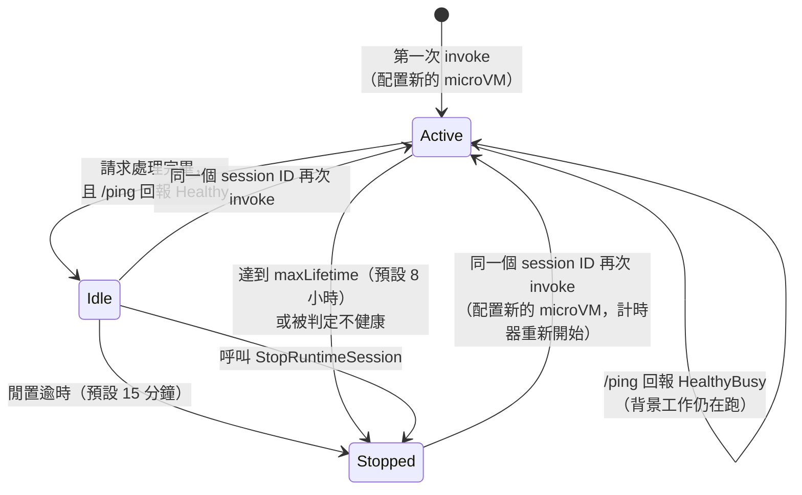

# Runtime

> Serverless 的 agent / tool 執行環境，框架與模型不限。
>
> 資料查核日期：2026-09-30。總覽層級的內容（計費、區域、Harness 比較）見 [00-overview](../00-overview/)，這裡不重複。

## TL;DR

- **資源模型：** Runtime → 不可變的 Version → 有名稱的 Endpoint → Session，**每個 Session 是一台獨立的 microVM**。這層層關係跟 Lambda 的 function → version → alias 幾乎一樣，差別在最後多了「session」這一層狀態。
- **兩個正交的選擇：**
  - **運算型態**：microVM（serverless，session 最長 8 小時）或 Instances（在自己帳號的 EC2 上跑，最長 14 天，可用 GPU）。
  - **平台版本**：V1，或 V2（從 snapshot 還原，冷啟動時間穩定，但程式碼要配合改寫）。
- **對開發者的要求其實很薄：** 一個在 `0.0.0.0:8080` 上實作 `POST /invocations` 和 `GET /ping` 的 ARM64 container 就行。其他協定只是換 port 和路徑。
- **AgentCore 不管「哪個 session 屬於哪個使用者」**，這件事要你的後端自己負責。這是最容易被忽略的安全責任。
- **2026 年的兩個強制變更：** MMDSv2 從 2026-06-30 起強制啟用，沒開的 runtime 無法被呼叫；direct code deploy 的 Python 3.10 / 3.11 從 2026-08-31 起**無法再更新**。

## 核心概念

### 資源模型

```
Agent Runtime（一個 agent 或 tool，有自己的 execution role）
├── Version 1, 2, 3 …（不可變；改 image、協定、網路等設定都會產生新版本；每個 agent 最多 1,000 個）
├── Endpoint（每個 agent 最多 10 個）
│     ├── DEFAULT → 永遠指向最新版本（自動建立）
│     └── prod / staging … → 手動指定版本，用來控制上線與回滾
└── Session（以 runtimeSessionId 識別）
      └── 一台專屬的 microVM：CPU、記憶體、檔案系統都跟其他 session 隔離
```

- **版本切換不會影響進行中的 session：** 每台 microVM 使用的是**建立當下**的程式碼。更新 runtime 之後，舊 session 會繼續跑舊版本，直到它結束為止。這跟 Lambda 很像，但 session 最長可以活 8 小時，所以新舊版本並存的時間也會比較長。
- **兩種 inbound 驗證只能擇一：** 每個版本只能選 IAM（SigV4）或 JWT（OAuth）其中一種。兩種都需要的話，就要分成不同的版本或 endpoint。

### 運算型態：microVM vs Instances

|  | microVM（預設） | Instances |
|--|----------------|-----------|
| 管理模型 | 全託管的 serverless | AWS 在**你的帳號**裡代管 EC2（EC2 managed instances） |
| Session 最長時間 | 8 小時 | 14 天 |
| 架構 | 只支援 `arm64` | `x86_64` 與 `arm64` |
| 網路 | PUBLIC 或 VPC | 只能用 VPC |
| 一個 session 裡的 agent 數 | 1 個 | **可以多個**：不同的 runtime 只要用同一個 session ID，就會落在同一台機器上，共享檔案系統 |
| GPU | 不支援 | 支援 g4dn、g5、g6、g6e、g7e、inf2 等機型，驅動程式由 AWS 安裝 |
| 持久儲存 | Session storage（預覽中）、EFS、S3 Files | EBS volume（由 capacity provider 定義） |
| 計費 | 依實際用量計費 | EC2 費用 + 12% 管理費（GPU 機型 7.8%）；可以套用 Savings Plans 或 RI |
| 單一 session 的硬體上限 | 2 vCPU / 8 GB | 取決於你選的機型 |

- **Capacity provider** 是 Instances 的「機器樣板」，定義作業系統、可用機型、VPC 和 EBS。建立之後**只能修改描述**，其他設定要改就得複製一份新的。
- 一個 runtime 的**運算型態建立後就不能再改**。
- **選擇原則：** 預設用 microVM。需要跑超過 8 小時、需要 GPU，或需要多個 agent 共用同一台機器協作時，才改用 Instances。

### 平台版本：V1 vs V2

V2 的原理跟 **Lambda SnapStart** 相同：先把環境初始化好，拍一張記憶體快照（snapshot），之後每次啟動新的 session 都直接從快照還原，不必每次重新初始化。

|  | V1（預設） | V2 |
|--|-----------|-----|
| 冷啟動 | 隨 image 大小和並發量變動 | **不論 image 大小或並發量都很穩定** |
| 建立或更新需要的時間 | 幾秒 | **幾分鐘**（要製作快照） |
| 啟動期限 | — | 啟動後 120 秒內 `/ping` 必須回報健康，否則建立失敗 |
| 環境變數大小上限 | 4 KB | 1.5 KB（direct code）/ 2.5 KB（container） |
| 單價 | 較低 | 較高，但閒置 120 秒後會回收記憶體 |
| 可用區域 | 所有支援的區域 | us-east-1、us-east-2、us-west-2、eu-west-1、**東京** |
| IaC | 支援 | **CloudFormation 和 CDK 目前無法設定 `platformVersion`** |

**使用 V2 時的程式碼規則：** 啟動階段做的事都會被凍結在快照裡，**每個從快照還原的實例都會拿到一模一樣的狀態**。

| 不要在啟動階段做 | 原因 | 應該改成 |
|-----------------|------|---------|
| 產生隨機數、UUID、token | 所有實例會拿到相同的值；`random` 模組的 seed 也是同一個 | 在 handler 裡呼叫 `secrets` 或 `os.urandom()` 產生 |
| 用 OpenSSL 等密碼學函式庫產生隨機值 | **這些函式庫在還原後目前不會重新取得亂數種子**（官方標示為已知限制） | 直接向作業系統取亂數 |
| 記錄時間，或用 `time.monotonic()` 當起點計算經過時間 | 時間會停在拍快照那一刻，而且 monotonic 時鐘在還原時不會前進 | 在 handler 裡重新取時間 |
| 拿 hostname 或 PID 當實例 ID | 還原後每個實例都是 `localhost` 和 PID `1` | 每個請求自己產生 ID |
| 快取短期有效的憑證 | 還原時可能已經過期 | 在 handler 裡取得，並在過期時刷新 |
| 在啟動時快取 Gateway 的工具清單 | 工具清單會被凍結在快照時的狀態 | 在執行期間才讀取 |

適合放在啟動階段的：import 套件、載入靜態設定、建立 client 並先暖機一次（連線本身不會延續到還原後，但 client 已經解析好的 endpoint 和憑證設定等快取會保留）。

## 部署方式

### 服務契約：不同協定只差在 port 和路徑

| 協定 | Port | 路徑 | 用途 |
|------|------|------|------|
| HTTP | 8080 | `POST /invocations`（回傳 JSON 或 SSE）、`/ws`（WebSocket）、`GET /ping` | 一般的 agent API |
| MCP | 8000 | `POST /mcp`（streamable HTTP） | 把 Runtime 當成 **MCP 工具伺服器**，讓其他 agent 呼叫 |
| A2A | 9000 | `/` | Agent 之間互相呼叫；靠 **Agent Card** 做服務發現，類似於 agent 版的 OpenAPI 文件 |
| AG-UI | 8080 | `/invocations`（SSE）、`/ws` | 前端 UI 專用的事件串流協定，可以把 agent 的中間步驟（呼叫了哪些工具、思考到哪裡）逐步渲染到畫面上 |

所有協定的共同要求：監聽 `0.0.0.0`，使用 **ARM64** container。`/ping` 回傳 `{"status": "Healthy"}` 或 `{"status": "HealthyBusy"}`（見[長時間任務](#長時間與非同步任務)）。

使用 `BedrockAgentCoreApp`（Python SDK）時，SDK 會幫你處理 `/ping` 和各個 endpoint。不用 SDK 也可以，只要自己的 HTTP server 符合上面的契約就好，這也是 Runtime 綁定程度低的原因。

### 打包方式：Container vs Direct code（zip）

|  | Container | Direct code（zip） |
|--|-----------|-------------------|
| 大小上限 | 2 GB | 壓縮後 250 MB，解壓後 750 MB |
| 支援的語言 | 任何語言 | Python 3.12–3.14、Node.js 22 |
| 誰負責修補語言執行環境 | **你**：要定期用最新的 base image 重新 build | **AWS**：自動套用修補，**無法關閉** |
| 更新速度 | 較慢 | 第二次之後的部署明顯較快 |
| 新 session 建立速率 | 見下方 ⚠️ | 25 個／秒 |

⚠️ **官方文件在 session 建立速率上前後矛盾：** Direct code 的頁面寫「container 部署每秒只能建立 1.6 個新 session」，但 Quotas 頁寫的是「25 TPS，container 和 direct code 共用」。如果你預期會有流量尖峰，**這個數字要先實測確認**。

⚠️ **Direct code 的語言版本淘汰時程：** Python 3.10 和 3.11 已經在 2026-06-30 標示為淘汰，並在 **2026-08-31 起禁止更新**。已經在跑的 runtime 如果還用這兩個版本，下次部署前必須先升級。

**官方建議：** 先用 direct code 快速迭代；等 package 超過 250 MB、需要特殊的系統相依套件，或已經有既有的 container CI/CD 時，再改用 container。

## Session 模型與生命週期



- **Session 本身不會過期，會消失的是 microVM：** Stopped 之後，用同一個 session ID 再呼叫，會配置一台新的 microVM，記憶體中的狀態就沒了。Session ID 會一直有效，直到 runtime 被刪除。
- **Session ID 至少要 33 個字元。** 可以由呼叫端提供；如果第一次呼叫時不帶，Runtime 會自動產生一個回傳給你。
- **路由靠 header 決定：** 同一個 session ID 的請求會被導向同一台 microVM。沒帶 session ID 的話，每個請求都可能落到新的 microVM，每次都要冷啟動。

| 協定 | Session header |
|------|----------------|
| HTTP / A2A / AG-UI | `X-Amzn-Bedrock-AgentCore-Runtime-Session-Id` |
| MCP | `Mcp-Session-Id` |

- **在 session 建立或銷毀的過程中送出請求，會收到 409 `RetryableConflictException`。** AWS SDK 會自動重試；MCP 協定則是回 HTTP 200，錯誤包在 JSON-RPC 的 body 裡，**不會自動重試**，要自己處理。

### Lifecycle 設定

| 參數 | 預設值 | 可設定範圍（microVM） | 可設定範圍（Instances） |
|------|--------|---------------------|------------------------|
| `idleRuntimeSessionTimeout` | 900 秒 | 60–28,800 秒 | 60–1,209,600 秒 |
| `maxLifetime` | 28,800 秒 | 60–28,800 秒 | 60–1,209,600 秒 |

- 閒置計時器**每次呼叫時都會重設**；`maxLifetime` 從 microVM 建立時開始算，**不會重設**。
- 取捨：閒置逾時越短越省錢（記憶體閒置時仍會計費），但使用者回來時冷啟動的機率也越高。

### 狀態要存在哪一層

| 存放位置 | 存活範圍 | 適合放什麼 |
|---------|---------|-----------|
| microVM 的記憶體與本機磁碟 | 到 microVM 停止為止 | 暫存資料 |
| **Session storage**（預覽中） | 跨越停止與恢復；**14 天沒被呼叫就清空**；**更新 runtime 版本時也會清空**；上限 1 GB | coding agent 的專案目錄、已安裝的套件 |
| EFS / S3 Files（需要 VPC） | 永久，由你自己管理；可以跨 session、跨 agent 共享 | 共用的工具庫、資料集、模型權重 |
| Capacity provider 的 EBS（僅 Instances） | 跨越停止與恢復，直到 session 被刪除 | 長時間任務的 checkpoint |
| AgentCore Memory | 永久，結構化 | 對話歷史、使用者偏好 |

Session storage 的其他限制：不支援 hard link 和 xattr；檔案權限會被記錄但**不會真的被檢查**，因為 VM 內只有一個使用者。每個 runtime 最多掛 5 個檔案系統，掛載路徑必須是 `/mnt/<名稱>`。

## 協定與串流

| 模式 | 上限 | 適用情境 |
|------|------|---------|
| 同步請求 | 15 分鐘，payload 100 MB | 一般的問答 |
| SSE 回應串流 | 60 分鐘，每個 chunk 10 MB | 讓回答一個字一個字出現（LLM 是逐 token 產生的，所以串流幾乎是標準配備） |
| WebSocket 雙向串流 | 60 分鐘，每個 frame 64 KB，每秒 250 個 frame | 互動式介面、文字或音訊雙向傳送 |
| WebRTC | 需要 VPC 模式，以及 **TURN relay**（KVS 代管、第三方服務，或自己架 coturn） | **語音 agent**：瀏覽器或手機的即時語音，走 UDP 延遲較低 |

**MCP 的兩種模式：**

- **Stateless**（預設建議）：由平台產生 `Mcp-Session-Id`，你的 server 不能拒絕這個 ID。
- **Stateful**：需要用到 MCP 的 elicitation（工具執行到一半反問使用者）或 sampling（工具反過來請 LLM 產生內容）時才需要。MCP `2026-07-28` 版的規格改用 multi round-trip requests，stateless 模式也能做到這兩件事。

## 長時間與非同步任務

做法：handler 先回應「已經開始處理」，實際工作放到背景執行緒，並讓 `/ping` 回報 `HealthyBusy`，session 就不會因為閒置被回收。

```python
task_id = app.add_async_task("report")   # SDK 會自動把 /ping 切成 HealthyBusy
...                                      # 在背景執行緒工作
app.complete_async_task(task_id)         # 所有任務完成後，/ping 會回到 Healthy
```

- **最長 8 小時**（microVM 的 `maxLifetime`）。更長的任務要改用 Instances（14 天）。
- **官方沒有提供「任務完成」的通知機制：** 文件描述的模式是「使用者晚點再回來查」，也就是用同一個 session ID 再呼叫一次。需要主動通知的話，要自己在任務結束時送到 SNS、EventBridge 或 webhook（這是我的設計判斷）。
- **最常見的坑：** 如果 handler 裡有阻塞的操作，而程式是單執行緒，`/ping` 就會一起被卡住，**15 分鐘後 session 會被當成閒置而砍掉**。阻塞的工作一定要放到其他執行緒，或改用 async。
- **另一個坑：** 自己實作 `/ping` 時，如果每次都把 `time_of_last_update` 設成現在時間，平台會以為狀態一直在變，session **永遠不會進入閒置**，會一直跑到 8 小時上限，最後把 session 配額耗光。

## 網路

- **PUBLIC 模式：** microVM 可以直接連到網際網路，但**連不到你 VPC 裡的資源**。
- **VPC 模式：** AgentCore 會透過 service-linked role 在你的子網路建立 ENI。
  - **放在 public subnet 並不會讓它連得到網際網路**，必須放在 private subnet，並透過 NAT 出去。
  - **只支援特定的 AZ。** 以東京為例，只支援 `apne1-az1`、`az2`、`az4`，**不支援 `az3`**。放錯 AZ，建立時就會失敗。
  - 建議加上 ECR、S3 gateway、CloudWatch Logs 的 VPC endpoint。Container 型的 agent 會定期從 ECR 重新拉取 image，沒有 S3 gateway endpoint 的話，這些流量都會算進 NAT 的處理費。
    - 不開 NAT 時，ECR `api`、`dkr` interface endpoint 是**必要的**：缺了 Runtime 建得起來（READY）但呼叫回 502（[WP3](../91-work-packages/WP3-sandbox-egress.md) #5）。
    - `[矛盾]` S3 gateway endpoint 政策照官方文件只放行 `prod-<region>-starport-layer-bucket` 時，Runtime 拉不到映像；「全允許＋拒絕匿名請求」可行（WP3 B 半）。
  - Runtime 刪除後，ENI 最多會在 VPC 裡**殘留 8 小時**才自動清掉。
- **呼叫端也可以走私有網路：** 用 PrivateLink 建立 `bedrock-agentcore`（資料面）與 `bedrock-agentcore-control`（控制面）的 interface endpoint。

## 安全要點

以下只列 Runtime 本身的部分；身分與憑證的細節留到 [04-identity](../04-identity/)。

1. **自己管理「session ↔ 使用者」的對應：** AgentCore 不會檢查呼叫者是不是這個 session 的主人。如果後端直接把前端傳來的 session ID 往下送，**A 使用者只要猜到或拿到 B 的 session ID，就能進入 B 的 microVM**。你的後端必須自己維護對應關係，並限制每個使用者能開的 session 數量。
2. **VM 裡的任何程式都拿得到 execution role 的憑證：** 取得方式跟 EC2 的 IMDS 一樣，走 microVM 的 metadata 服務（MMDS）。而 agent 可能會執行它自己產生的程式碼，所以 **execution role 必須最小權限**，而且權限不能大於「能呼叫這個 agent 的人」的權限，否則就會出現權限提升的漏洞。
3. **MMDSv2 從 2026-06-30 起強制啟用：** 沒有設定 `metadataConfiguration.requireMMDSV2 = true` 的 runtime，呼叫時會收到 `ValidationException`。
4. **一定要驗證 `prompt` 的型別：** payload 是任意 JSON。如果呼叫端把 `prompt` 塞成一個 `toolUse` 結構，某些框架會**直接執行那個工具，完全跳過模型判斷和 guardrail**。務必檢查它是字串，最好用 Pydantic 或 Zod 定義 schema。
5. **把 Gateway 放在 Runtime 前面，並鎖定只接受 Gateway 的請求：** 這樣 Policy、Guardrails、interceptor 等控制才不會被繞過。IAM 型的 runtime 用 resource policy 限制；JWT 型的用 `allowedWorkloadConfiguration` 限制。
6. **限制 agent 存取 localhost：** 每台 microVM 裡都有一個跑在 localhost 的平台服務，負責 session 生命週期、儲存與 shell。如果 agent 的 HTTP 工具可以任意打 localhost，就會變成 SSRF 的入口。影響範圍雖然只限於這個 session，但仍然可以破壞 session，或取得 shell。
7. **下 shell 指令的 API 用另外的 IAM action：** `InvokeAgentRuntimeCommand` 和 `InvokeAgentRuntimeCommandShell` 各自有獨立的權限。**能呼叫 agent 的人，不一定需要能直接下指令。**
8. **AgentCore CLI 產生的 IAM policy 只適合開發環境**，權限給得很寬，官方明確表示不要直接用在正式環境。
9. **自訂 header 要先加入白名單：** 每個 runtime 最多 20 個 header，每個值最大 4 KB；`x-amz-*` 和 `x-amzn-*` 開頭的都不能用（`X-Amzn-Bedrock-AgentCore-Runtime-Custom-*` 除外）。

## 冷啟動與效能

**官方沒有公布冷啟動的具體數字。** 以下是從文件整理出的影響因素：

| 因素 | 影響 |
|------|------|
| 平台版本 | V1 隨 image 大小和並發量變動；V2 從快照還原，比較穩定 |
| Image 大小 | 對 V1 影響明顯，對 V2 影響較小 |
| VPC 模式 | 官方提到可能增加 session 的啟動時間 |
| 掛載 EFS / S3 Files | 每個掛載的逾時是 30 秒，而且是平行掛載，**任何一個失敗就整個請求失敗**（HTTP 424） |
| 有沒有帶 session header | 沒帶的話，每個請求都可能是一次冷啟動 |
| 閒置逾時 | 越短越容易觸發冷啟動 |
| Instances | 第一次呼叫要先配置 EC2，所以明顯比較慢 |

→ 冷啟動數據需要自己實測，已列為實驗題目。

## 踩雷清單

1. **Session 與使用者的對應要自己管。** 詳見[安全要點](#安全要點)第 1 點。
2. **Handler 阻塞會卡住 `/ping`：** 長時間任務會在 15 分鐘時被砍掉。
3. **自己寫 `/ping` 時亂設 `time_of_last_update`：** session 永遠不會被回收，最後耗光配額。
4. **V2 在啟動階段產生的隨機值、時間、憑證，所有實例都一樣。**
5. **更新版本會清空 session storage：** 如果 coding agent 的專案目錄放在這裡，每次部署新版本，使用者的工作區就會被重置。
6. **`UpdateAgentRuntime` 是完整覆寫（full PUT）：** 就算只想改一個設定，也要把 `roleArn`、`agentRuntimeArtifact`、`networkConfiguration` 等必填欄位全部帶上。
7. **VPC 放在 public subnet 還是出不了網，而且 AZ 有白名單限制。**
8. **MMDSv2 沒開就無法呼叫**（2026-06-30 起）。
9. **Direct code 使用 Python 3.10 / 3.11 的話，已經無法更新**（2026-08-31 起）。
10. **V2 無法透過 CloudFormation 或 CDK 設定。** 用 IaC 管理的團隊目前得額外用 API 處理。
11. **Container 的 session 建立速率，官方文件寫法不一致**，要實測。

## 與其他元件的關係

- **Harness** 底層就是跑在 Runtime 上，配額也共用（見 [00 延伸](../00-overview/harness-vs-runtime.md)）。
- **Identity**：inbound 驗證（SigV4 / JWT）和 outbound 憑證都由 Identity 提供。
- **Gateway**：建議放在 Runtime 前面當唯一入口；Runtime 也可以掛在 Gateway 底下，當成它的一個 target。
- **Memory**：Runtime 的 session 狀態是暫時的，需要長期保存的東西應該寫進 Memory。
- **Observability**：Runtime 會自動輸出 trace、log 和 metric 到 CloudWatch。
- **Nova Act**：Nova Act CLI / IDE 的一鍵部署，底層就是把 workflow 包成 Runtime 容器；也可以自己寫 `@app.entrypoint` handler（見 [Nova Act 02](../nova-act/02-deploy-operate/)、[04](../nova-act/04-agentcore/README.md#runtime跑-workflow)）。

## 研究問題

- [x] 部署方式（CLI、container、code zip）
- [x] Session 隔離與生命週期（microVM、逾時）
- [x] 支援的協定（HTTP、MCP、A2A、AG-UI）與 streaming
- [x] 長時間執行 / 非同步任務的處理方式
- [x] 冷啟動與效能（官方沒有數字，待實驗）

## 延伸調研

- [用 Runtime 做 coding agent 的架構設計](coding-agent-architecture.md)：工作區放哪裡、版本更新會清空工作區的因應、憑證與 prompt injection、Harness 還是 Runtime
- [Instances 上的多 agent 協作](instances-multi-agent.md)：隔離邊界、權限疊加、適用情境、多 agent 模式比較

## 實驗

- [冷啟動與 session 建立速率](experiments/cold-start/README.md)：實驗工具已完成、本機驗證通過，**尚未在 AWS 上實跑**（撰寫時沒有 AWS 憑證）。矩陣為 V1/V2 × container/zip × PUBLIC/VPC，外加大 image，並用來驗證 V2 snapshot 的狀態重複問題，以及 1.6/s 與 25/s 的文件矛盾。**將由 [WP1](../91-work-packages/WP1-runtime-session.md) 在 AWS 實跑**，結果回填到實驗的 README

## 參考資料

- [How it works：microVMs](https://docs.aws.amazon.com/bedrock-agentcore/latest/devguide/runtime-how-it-works.html)、[Instances](https://docs.aws.amazon.com/bedrock-agentcore/latest/devguide/runtime-instances-how-it-works.html)
- [Service contract](https://docs.aws.amazon.com/bedrock-agentcore/latest/devguide/runtime-service-contract.html)：[HTTP](https://docs.aws.amazon.com/bedrock-agentcore/latest/devguide/runtime-http-protocol-contract.html)、[MCP](https://docs.aws.amazon.com/bedrock-agentcore/latest/devguide/runtime-mcp-protocol-contract.html)
- [Optimize your agent for V2](https://docs.aws.amazon.com/bedrock-agentcore/latest/devguide/runtime-v2-optimize.html)
- [Direct code deployment](https://docs.aws.amazon.com/bedrock-agentcore/latest/devguide/runtime-get-started-code-deploy.html)、[Supported runtimes](https://docs.aws.amazon.com/bedrock-agentcore/latest/devguide/runtime-code-deploy-supported-runtimes.html)
- [Sessions](https://docs.aws.amazon.com/bedrock-agentcore/latest/devguide/runtime-sessions.html)、[Lifecycle settings](https://docs.aws.amazon.com/bedrock-agentcore/latest/devguide/runtime-lifecycle-settings.html)
- [File system configurations](https://docs.aws.amazon.com/bedrock-agentcore/latest/devguide/runtime-filesystem-configurations.html)
- [Async / long running](https://docs.aws.amazon.com/bedrock-agentcore/latest/devguide/runtime-long-run.html)
- [Bidirectional streaming](https://docs.aws.amazon.com/bedrock-agentcore/latest/devguide/runtime-bidirectional-streaming.html)、[WebRTC](https://docs.aws.amazon.com/bedrock-agentcore/latest/devguide/runtime-webrtc.html)
- [VPC](https://docs.aws.amazon.com/bedrock-agentcore/latest/devguide/agentcore-vpc.html)
- [Security best practices](https://docs.aws.amazon.com/bedrock-agentcore/latest/devguide/runtime-security-best-practices.html)
- [Custom headers](https://docs.aws.amazon.com/bedrock-agentcore/latest/devguide/runtime-header-allowlist.html)
- [Quotas](https://docs.aws.amazon.com/bedrock-agentcore/latest/devguide/bedrock-agentcore-limits.html)

## 延伸調研方向

範圍在 00–01 之內，以 01 為主：

1. **Runtime 的版本與 endpoint 上線策略：** 怎麼用不可變版本加上具名 endpoint 做 canary 或藍綠部署；舊 session 最長會跑舊版 8 小時，這段新舊並存期間，API 相容性該怎麼設計；以及 V2 更新要等好幾分鐘，CI/CD 流程要怎麼因應。
2. **Session 和使用者綁定的後端參考設計：** session ID 怎麼產生、存放、過期；每個使用者的 session 數量上限；如何用 CloudTrail 偵測有人存取了別人的 session；以及「每個租戶一個 IAM principal」的做法怎麼落地。
3. **Runtime 的成本模型實算：** 以 coding agent、客服 agent 這兩種工作負載為例，比較 V1 / V2 / Instances 在不同閒置逾時設定下的月費，重點看「記憶體閒置時仍然計費」的影響。

> 第 2、3 題和[技術選型工作包](../91-work-packages/)的 [WP1](../91-work-packages/WP1-runtime-session.md)（一位使用者固定一個 session、並行請求、帳單）與 [WP5](../91-work-packages/WP5-user-state-isolation.md)（每位使用者的月費）重疊。做這兩題之前，先看 WP 的回填結果。
