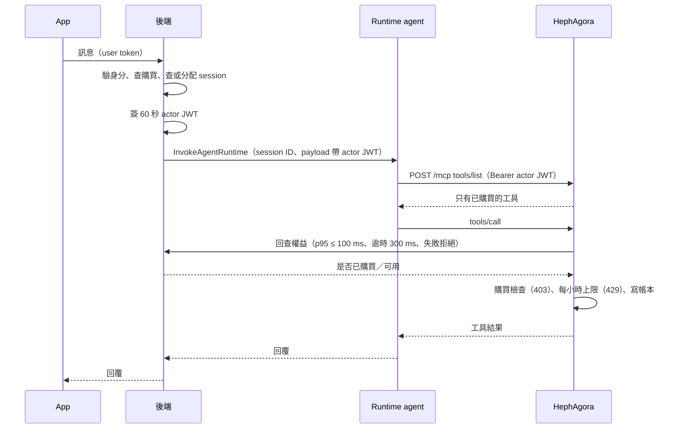
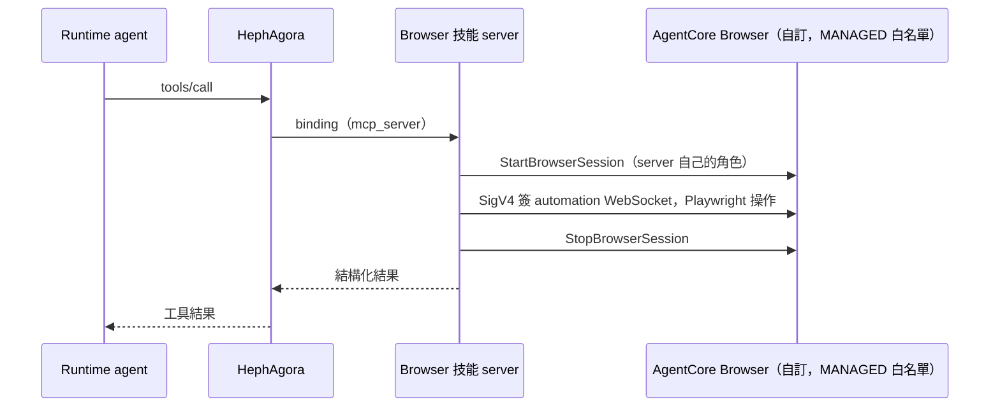
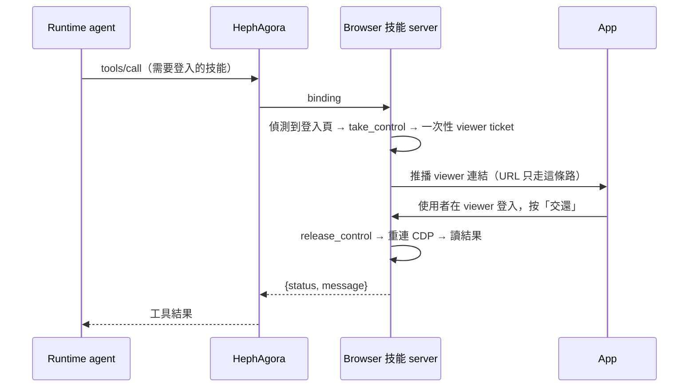

# 對話 agent 架構設計

> 依 [91 技術選型調研工作包](../91-work-packages/) 的實測結果（2026-10-02～10-05，東京）定下的設計，給開發團隊照著實作。
>
> 決策來源：思源「2 落差討論」G01–G22（2026-10-05 全部決定；Josh、Kais 決定，部分由 Claude 代決）。決策改動研究結論之處標「（落差討論 Gxx）」。
>
> 寫法：每個事實附 WP 或實驗的連結；研究沒驗證的標「未驗證」；研究沒寫、由本文件補的標「建議」。

## 一、選型決定

| 決定 | 理由與證據 | 不採用 |
|---|---|---|
| **方案 B：AgentCore Runtime 跑自寫 agent**（落差討論 G01，已定案） | 三個方案都沒有阻斷項；方案 B 每人每月含模型約 $3.4–4.2（Haiku 4.5），能力邊界與資料隔離都已實證（[決策矩陣](../91-work-packages/README.md#決策矩陣全部回填後匯整)） | 方案 A（OpenClaw 跑在 AgentCore）：每人約 $20.7，模型佔 94%，另有網路固定費（[WP7](../91-work-packages/WP7-openclaw-on-agentcore.md#回填)）。方案 C（自架）：沒有比方案 B 便宜的人數門檻，維運約 60 點（[WP6](../91-work-packages/WP6-oss-alternatives.md#8-門檻方案-c-比方案-b-便宜的使用者規模)） |
| **主 agent 用 Runtime，不用 Harness** | 預喚醒後首句 p50 170–196 ms（[WP1](../91-work-packages/WP1-runtime-session.md#回填)） | Harness 也可行，但第一次呼叫約 38 秒、使用者 token 要由後端明文組進 `tools` 參數（[skill-gating](../08-policy/experiments/skill-gating/README.md)） |
| **Runtime V1＋小 image＋預喚醒** | 小 image 時 V2 只差不到 2 秒，不值得 V2 的限制（[WP1](../91-work-packages/WP1-runtime-session.md#回填)） | V2：只有「大 image＋突發流量」才值得 |
| **一位使用者一個 session，多個聊天室共用，可並行**（落差討論 G17） | 並行請求不會卡 `/ping`，前提是 handler 為 async 或多執行緒（[WP1](../91-work-packages/WP1-runtime-session.md#回填)）。**每個聊天室或任務各用一個 Agent 實例**：同一個 Strands `Agent` 實例不能並行，第二個請求會丟 `ConcurrencyException`；各一個實例並行 468–592 ms、10/10 沒串（[WP6](../91-work-packages/WP6-oss-alternatives.md)） | 一個聊天室一個 session：不需要。同一使用者任務排隊：不採用 |
| **部署用固定版本的 endpoint** | 透過 DEFAULT 恢復時，換版本會清空 session storage；固定版本的 endpoint 不會（[WP1](../91-work-packages/WP1-runtime-session.md#回填)） | DEFAULT endpoint |
| **技能授權只放在自家 MCP server（HephAgora），不用 Gateway；購買資料每次回查後端 `CapabilityAccessService`**（落差討論 G15） | `tools/list` 過濾、未購買呼叫被拒、身分從 Runtime 帶到 server 都通過（[WP2](../91-work-packages/WP2-capability-boundary.md#回填)）。回查：`check`／`authorize` p95 ≤ 100 ms、逾時 300 ms，逾時或錯誤一律拒絕（fail closed）、回可重試錯誤，不當成「未購買」也不放行；HephAgora 一般工具 p50 約 21 ms，預算不會成為瓶頸（Claude 代決，實測後可調） | 同步 `skill_entitlements`（`wp2/skill-gating` 目前的實作，要改）；Gateway＋Policy：server 本來就要自己驗使用者，再加等於做兩次；MCP target 不能轉傳使用者 token。授權函式庫（Cedar、OPA）省不了程式碼（[WP6](../91-work-packages/WP6-oss-alternatives.md#第-3-層工具閘道與授權)） |
| **Browser 包成 HephAgora 的技能，VM 開不了 Browser；Josh 文件的 adapter 邏輯（控制權 lease、操作守門）搬進 Browser 技能 server**（落差討論 G02，Claude 代決） | execution role 呼叫 `StartBrowserSession` 被拒；白名單外的網址被 MANAGED 政策擋下（[WP2](../91-work-packages/WP2-capability-boundary.md#回填)）；execution role 全使用者共用，VM 裡讀得到憑證，給 Browser 權限等於每個 VM 都能開任何 Browser（[WP5](../91-work-packages/WP5-user-state-isolation.md#回填)） | agent 或 Runtime 內的 Node adapter 直接開 Browser |
| **第一版不用 Nova Act：只做事先列舉的受控網站，每站一支固定流程的 Playwright 腳本，加改版監控（腳本失敗率升高就告警）**（落差討論 G03，Claude 代決） | Nova Act 只在 us-east-1、prompt 只支援英文、預設每帳號 5 TPS；POC 嚴格全程驗證與 Pinkoi 實站都沒過；本文件實證的是固定流程 Playwright（[WP2](../91-work-packages/WP2-capability-boundary.md#回填)） | Nova Act、無法事先列舉的網站：第二階段做對照實測再決定 |
| **接手登入由 server 主導，推播 viewer 連結；工具同步等待，上限 5 分鐘，超過即結束任務、使用者重來**（落差討論 G04、G07） | 在 iOS 模擬器走完全程，agent 拿不到 Live View URL（[takeover](../08-policy/experiments/skill-gating/takeover/README.md)）。第一版不做 checkpoint／resume，持久停等列第二階段 | 非同步通知；持久停等（checkpoint／resume） |
| **任務協調放 BFF（`ai_family_backend`）worker，TypeScript；任務與訊息都在 BFF，不需要 outbox、webhook**（落差討論 G05、G06） | BFF 已有 worker 框架（heartbeat、DLQ、graceful shutdown）、Prisma、actor JWT、推播、`CapabilityAccessService`；等待使用者時不持有 DB 交易或連線；`agent-task` queue 設獨立 maxConcurrent；命名一律用 `AgentTask`／`agent-task`（BFF 已有 `/device/task`） | 獨立任務服務（Go＋PostgreSQL）：量上來、要做 checkpoint／resume 或有專人負責時再拆 |
| **actor JWT 維持 60 秒，由 BFF 在每次工具呼叫前換新**（落差討論 G16） | 保住「token 外洩最大損害＝本人 60 秒內能做的事」的假設（[WP5 #10](../91-work-packages/WP5-user-state-isolation.md#回填)）；第一版等待上限 5 分鐘，換新次數有限 | 長任務用 ≤ 15 分鐘、綁 `task_id` 的 token |
| **第一版不做跨任務記憶、不做定時任務**（落差討論 G12、G13） | 只保存本任務內的需求與選擇；POC 的每日排程留到後續版本。Memory 的隔離規則見「二」，後續階段再用 | AgentCore Memory 存偏好；每日排程（S5） |
| **意圖判斷在 BFF 用 Jev，呼叫 HephMind 之前；Jev 不進 HephMind**（落差討論 G11） | 驗收照 200 句評測集：準確率 ≥ 90%、誤觸發 ≤ 3%；Jev 信心不足或逾時時當一般聊天（建議，待 Kais 確認）。聊天裡的工具呼叫之後會從 HephMind 拿掉，在那之前，判成 agent 任務的訊息不送 HephMind，避免重複執行 | 在 HephMind 判斷 |
| **基礎設施用 Terraform，以 `aws-terraform-template` 的 main 為準；程式放新 repo `hephai/faiya-agent`（`runtime/`、`browser-skill/`，分開部署、獨立 IAM 角色），hephclaw 封存**（落差討論 G21、G22） | main 比 dev 新（dev 停在 9/22）；`runtime/` 從 `skill-gating/agent/main.py` 長出來，`browser-skill/` 從 `takeover/browser_skill.py` 長出來 | CDK（只留研究用）；Browser 技能 server 放 HephAgora `src/mcp-servers/` |
| **Runtime 放在沒有 NAT 的 VPC，用 VPC peering 連 HephAgora** | 擋得住外網，仍連得到自家 server（[WP3](../91-work-packages/WP3-sandbox-egress.md#回填)） | NAT：多一筆固定費且放行外網 |
| **Code Interpreter 用 Sandbox 模式** | 擋得住一般外網（[WP3](../91-work-packages/WP3-sandbox-egress.md#回填)）；缺口見「六」 | Public 模式 |
| **模型是設定值，主模型由 Kais 決定；研究預設 Haiku 4.5**（落差討論 G20） | 模型費每人每月約 $0.9–1.4；品質不夠時改設定換 Sonnet 4.6（約 $2.9–3.4）（[token-cost](../90-integrations/experiments/token-cost/README.md)）。Haiku 4.5 的 model card 寫「EOL no sooner than Oct 16, 2026」，**10/12 前要確認 EOL 日期** | — |
| **區域：全部東京 `ap-northeast-1`，沒有跨區**（落差討論 G20） | 公司機器與 HephAgora 都在東京；第一版不用 Nova Act（us-east-1），不用為跨區處理更新隱私政策 | us-east-1 |

## 二、元件與責任

| 元件 | 要做 | 不能做 |
|---|---|---|
| **App** | 帶 user token 呼叫後端；收到推播後開 Live View viewer，讓使用者接手、交還 | — |
| **後端（BFF）** | 驗身分、查已購買的能力、查或分配 runtime session（對照表）、範圍外的請求先擋；**任務協調**（`agent-task` worker，落差討論 G05）與**意圖分流**（Jev，G11）；提供 `CapabilityAccessService` 供 HephAgora 回查（G15）；每次呼叫 Runtime、每次工具呼叫前簽 60 秒的 actor JWT（G16）；需要時發範圍縮小的臨時憑證；session ID 要對得回使用者（以使用者 ID 開頭或保留對照表）；Memory 的 actorId 用不透明 ID，對照表放自家 DB（[WP5](../91-work-packages/WP5-user-state-isolation.md#回填)） | 不該有 `InvokeAgentRuntimeCommand` 權限（[WP5](../91-work-packages/WP5-user-state-isolation.md#回填)） |
| **Runtime agent** | 每個請求用 payload 裡的 actor JWT 連 HephAgora `/mcp`，工具清單完全由 HephAgora 決定；handler 為 async；每個聊天室或任務各一個 Agent 實例（落差討論 G17）；長任務期間 `/ping` 回 `HealthyBusy`（[WP1](../91-work-packages/WP1-runtime-session.md#回填)） | 不自己把 prompt 或臨時憑證寫進 log |
| **HephAgora** | 驗 actor JWT；**每次回查後端權益**（不再靠同步表 `skill_entitlements`；p95 ≤ 100 ms、逾時 300 ms、失敗一律拒絕並回可重試錯誤，落差討論 G15）過濾 `tools/list`；`tools/call` 檢查購買（403）、每小時上限（429）、寫調用帳本 `tool_invocations`；一律依 actor 取資料（[skill-gating](../08-policy/experiments/skill-gating/README.md)） | 不信任工具參數裡的使用者 ID（[WP5 #10](../91-work-packages/WP5-user-state-isolation.md#回填)）；錯誤時不把內部 server 位址回給 agent（[takeover](../08-policy/experiments/skill-gating/takeover/README.md)） |
| **Browser 技能 server** | 獨立 repo（`faiya-agent` 的 `browser-skill/`）、獨立部署、獨立 IAM 角色（落差討論 G21）；用自己的 AWS 憑證開 Browser；含控制權 lease 與操作守門（G02）；受控網站用 Playwright 固定腳本（G03）；`UpdateBrowserStream` 停／啟 automation 要接上主路徑；操作完一定 `StopBrowserSession`；只回結構化結果；保證 A 的請求只拿 A 的 Browser profile | 不把 Live View URL 回給 HephAgora 或 agent |
| **Code Interpreter** | Sandbox 模式；套件預先打包成 wheel 送進沙箱（aarch64、Python 3.12），因為 PyPI 不通（[WP3](../91-work-packages/WP3-sandbox-egress.md#回填)） | 處理使用者資料時不用 Public 模式 |
| **Memory**（第一版不做，落差討論 G12；以下為後續階段的規則） | event 用 `actorId`、record 用 `namespace`／`namespacePath` 限制，每位使用者一個 principal；reflection 設在 actor 層級；控制寫入速率，避免 `LTM_RATE_EXCEEDED`（[WP5](../91-work-packages/WP5-user-state-isolation.md#回填)） | — |

**IAM 角色**

| 角色 | 權限 | 禁止 |
|---|---|---|
| Runtime execution role | 拉映像、寫 log、呼叫模型 | **任何 Browser 動作**；Code Interpreter 的 execution role 要零權限，因為沙箱裡讀得到它的憑證（[WP3](../91-work-packages/WP3-sandbox-egress.md#回填)） |
| Browser 技能 server 的角色 | 只能操作指定的 Browser ARN 與 profile | — |
| 使用者資料用的角色（供後端 AssumeRole） | 由 session policy 縮到單一使用者 | **trust 只寫後端**。實測 trust 寫了 execution role 時，VM 不需要 `sts:AssumeRole` 權限就能自己 assume、讀到別人的資料（[WP5 #4](../91-work-packages/WP5-user-state-isolation.md#回填)） |

## 三、串接流程

### 1. 一則訊息：從發出到收到回覆

- **預喚醒**：使用者打開聊天室時，後端先對該 session 送一個空請求，不必等回應（[WP1](../91-work-packages/WP1-runtime-session.md#回填)）。
- **延遲**：MCP 一般工具 p50 約 21 ms；一次對話約 3–4.5 秒，大部分是模型（[skill-gating](../08-policy/experiments/skill-gating/README.md)）。
- **token 外洩的最大損害**：A 本人在 60 秒內能做的事（[WP5 #10](../91-work-packages/WP5-user-state-isolation.md#回填)）。
- **看不到的工具**一律回 `Unknown tool`。
- **JWT 換新**：actor JWT 維持 60 秒，BFF 在每次工具呼叫前換新（落差討論 G16）；圖中 `tools/list`、`tools/call` 各用當下有效的 JWT。agent 端如何在長任務中取得新 JWT，機制未定，見「六」。

### 2. 需要瀏覽器的技能

- 端到端 p50 約 5.8 秒，大多是開 session；每次呼叫約 $0.00016（[WP2](../91-work-packages/WP2-capability-boundary.md#回填)）。
- 實驗用固定流程的 Playwright，不是瀏覽子 agent；「子 agent 自己亂逛」未驗證。

### 3. 接手登入（server 主導，同步，上限 5 分鐘）

- 實測：偵測登入頁到推播 5.7 秒；開連結到 Live View 第一個畫面 2.4 秒；交還後 1.5–3.6 秒拿到結果（[takeover](../08-policy/experiments/skill-gating/takeover/README.md)）。
- **逾時**（落差討論 G07）：等待使用者上限 5 分鐘，超過即結束任務、使用者重來；不做 checkpoint／resume。binding 的 `timeout_ms`、agent 端 MCP 的 HTTP 逾時、SQS visibility timeout 都要大於 5 分鐘，且工具要比 binding 早結束（建議：工具 300 秒、binding 330 秒以上；原研究值為工具 270 秒、binding 300 秒）。使用者沒交還時回 `user_did_not_complete_login`，server 照常 release、停 session。等待期間不持有 DB 交易或連線（G05）。
- 接手會切斷原本的 CDP 連線，交還後要重連；每個 CDP 指令設逾時，逾時就重連重試（[WP6](../91-work-packages/WP6-oss-alternatives.md#第-4-層雲端瀏覽器與接手)）。
- viewer 要自己加 HTML 輸入框轉送按鍵，Safari 點 DCV 畫面不會叫出鍵盤；中文逐字送時每個事件間隔 30 ms（[WP6](../91-work-packages/WP6-oss-alternatives.md#第-4-層雲端瀏覽器與接手)）。
- Browser 政策要加 `PasswordManagerEnabled: false`，否則雲端 Chrome 會想存使用者輸入的密碼。

### 4. VM 存取使用者資料

1. 後端 `AssumeRole`，帶 session policy（例如 S3 只允許 `users/<A>/*`），把臨時憑證放進呼叫 Runtime 的 payload。實測讀 A 成功、讀 B 被拒（[WP5 #3](../91-work-packages/WP5-user-state-isolation.md#回填)）。
2. 該角色的 trust 只寫後端（範本 [`trust-backend.json`](../02-memory/experiments/tenant-guard/aws/iam/trust-backend.json)）。
3. STS 有速率上限，憑證要快取到過期前。

## 四、網路與部署

- **VPC**：Runtime 放 private subnet，無 NAT、無 IGW；VPC 模式在東京只支援 az1、az2、az4。用 VPC peering 連 HephAgora 所在的 VPC，peering 沒有每小時費（[WP3](../91-work-packages/WP3-sandbox-egress.md#回填)）。VPC 模式不增加冷啟動（[WP1 #11](../91-work-packages/WP1-runtime-session.md#回填)）。
- **必要的 VPC endpoint**（[WP3](../91-work-packages/WP3-sandbox-egress.md#回填)）：
  - Interface：ECR `api`、ECR `dkr`、CloudWatch Logs、Bedrock runtime，單 AZ $40.88／月、雙 AZ $81.76／月。缺 ECR 時 Runtime 建得起來但呼叫回 502；缺 Logs 時照常運作但收不到 log。
  - S3 gateway endpoint（免費），政策用「全允許＋拒絕匿名請求」；照官方文件只放行 ECR 層 bucket 會拉不到映像。
- **閒置逾時**：預設 900 秒，可設 60–28,800 秒；費用跟 session 活著的秒數成正比，九成以上是記憶體。最後一次使用後主動 `StopRuntimeSession` 可省掉閒置的 21%（[WP1](../91-work-packages/WP1-runtime-session.md#回填)）。
- **成本分攤**：`USAGE_LOGS` 依 session 加總即得每位使用者的用量，與 metric 差 0%；同一個 log group 會混到其他 runtime，要依 `agent.name` 過濾（[WP5 #5](../91-work-packages/WP5-user-state-isolation.md#回填)）。
- **tag**：每個資源加 `project=hyfai` 與負責人。
- **IaC**：Runtime、VPC、IAM 用 Terraform，以 `aws-terraform-template` 的 main 分支為準，deploy 資料夾跟著各 repo 建立（落差討論 G22）；CDK 只留研究用。

## 五、上架新能力

前提：HephAgora 的一次性改動已上線（授權約 70 行、MCP 入口約 150 行、Browser server 約 200 行，開關 `HEPHAGORA_REQUIRE_ACTOR=1`、`HEPHAGORA_MCP_FACADE=1`）。注意：`wp2/skill-gating` 目前的授權是讀同步表 `skill_entitlements`，要依落差討論 G15 改成每次回查後端；開 MR 前要清掉分支裡的 `cookies.txt`、`.codegraph/`、測試用 `src/wp2/todo.ts`（Kais）。之後**每新增一個技能，不改 HephAgora 程式碼**，只動資料與設定；agent 端也不用改，因為每次都從 `/mcp` 動態拿工具清單（[skill-gating #12](../08-policy/experiments/skill-gating/README.md)）。

### 一般技能

| # | 步驟 | 誰做 | 說明 |
|---|---|---|---|
| 1 | 寫技能後端（HTTP adapter 或 MCP server） | 技能開發者 | — |
| 2 | Service manifest：能力名稱、描述、`input_schema`、binding | 技能開發者 | `PUT /v1/registry/services/{id}` → 送審 → 審核 → 發布。描述要含使用者會講的詞（BM25 檢索）。MCP 工具名自動產生：`<service_id 點換底線>__<capability>` |
| 3 | 標成付費：`skill_products` 加一筆，含 `max_calls_per_hour` | 營運 | 目前沒有管理介面 |
| 4 | 權益由後端 `CapabilityAccessService` 判定，HephAgora 每次回查，不寫 `skill_entitlements`（落差討論 G15） | 後端 | 逐項解鎖：權益檢查程式第一版就做好；11/2 前的 20 人內測全部能力免費開放、不扣款，Go 之後再開收費（G14）。額度預留／結算第一版不做 |
| 5 | OAuth 類技能：manifest 的 `oauth_scopes`、client 憑證環境變數 | 技能開發者＋維運 | 未驗證 |
| 6 | 上架驗收（見下方） | 技能開發者 | — |

### 需要瀏覽器的技能，另外要做

| # | 步驟 | 說明 |
|---|---|---|
| 1 | MANAGED 政策檔放 S3：`URLBlocklist *`、`URLAllowlist <技能的網域>`、`PasswordManagerEnabled: false` | 每個技能（或每組白名單）一個 |
| 2 | 建自訂 Browser，指向該政策檔 | 政策只在 CreateBrowser 時讀取，**改白名單要重建 Browser** |
| 3 | Browser 技能 server 的角色加該 Browser ARN 的權限 | execution role 不加 |
| 4 | manifest 的 `mcp_server` binding 指向 Browser 技能 server | 會接手登入的技能，`timeout_ms` 要比工具總預算長（建議 330 秒以上 vs 工具 300 秒，等待上限 5 分鐘，落差討論 G07） |
| 6 | （第一版）網站必須事先列舉，每站一支固定流程的 Playwright 腳本，並接上改版監控 | 落差討論 G03；不在清單內的網站不支援 |
| 5 | 要保存登入狀態時，profile 依「使用者 × 網站」建立並加 tag，只給 server 的角色權限 | [WP5 #11](../91-work-packages/WP5-user-state-isolation.md#回填) |

### 上架驗收清單（建議）

研究只有實驗腳本（`check.sh`、`authz_check.sh`），以下依實驗檢查項整理成正式清單：

- [ ] 沒買的使用者 `tools/list` 看不到這個工具
- [ ] 沒買的使用者直接 `tools/call` 回 `Unknown tool` 或 403
- [ ] 後端權益回查逾時或失敗時，一律拒絕並回可重試錯誤，不當成「未購買」也不放行（落差討論 G15）
- [ ] 有買的使用者呼叫成功，調用帳本記成該使用者
- [ ] 超過 `max_calls_per_hour` 回 429
- [ ] （瀏覽器技能）白名單外的網址回 `ERR_BLOCKED_BY_ADMINISTRATOR`
- [ ] （瀏覽器技能）agent 對話、HephAgora log、帳本裡搜不到 Live View URL
- [ ] （接手登入）使用者不交還時，5 分鐘內收掉並回明確狀態；接手時輸入的帳密沒有被保存

## 六、待決與上線前必做

| 項目 | 現況 | 下一步 |
|---|---|---|
| **actor JWT 長任務換新機制** | 落差討論 G16 定了「60 秒、BFF 每次工具呼叫前換新」，沒定 agent 端怎麼拿到新 JWT（工具呼叫經協調端轉送，或 agent 端自動換新） | 建議在 M2（10/19）第一張卡前定案並實測 `tools/list`／`tools/call` 之間換新 |
| **主模型與 Haiku 4.5 EOL** | 主模型交給 Kais；Haiku 4.5 EOL「no sooner than Oct 16, 2026」 | Kais 10/12 前確認 |
| **仍待對齊的人** | G02、G04、G08、G15：Roman；G03、G09、G11、G21：Kais；G10、G14、G18、G19：David | 對齊後勾思源各項的「已對齊」 |
| **第一版不做** | Nova Act 與無法事先列舉的網站、持久停等（checkpoint／resume）、定時任務、跨任務記憶、額度預留結算、Android renderer、A2UI P1／P2 | 見落差討論 G03、G07、G12、G13、G18 |
| **接手登入的真機驗證** | 只在 iOS 模擬器通過；真 iPhone、Android 沒測；iOS 鍵盤開著時點擊偶爾偏移；有 CAPTCHA、OTP、跨站 SSO 的網站沒測 | 真機驗證；有問題時的替代方案（電腦接手、App 原生登入表單、網站的委派授權）見 [WP2 #8](../91-work-packages/WP2-capability-boundary.md#回填) |
| **HephAgora 呼叫外部 MCP server 時不帶 actor** | Browser 技能 server 不知道要推播給誰 | HephAgora 把 actor 傳給 binding（約 5 行），或改由 HephAgora 自己推播 |
| **限流不是原子操作** | 先數再放行，大量並發時可能多放行 | 改成 `UPDATE … WHERE count < limit RETURNING` 或 Redis `INCR`（[WP6](../91-work-packages/WP6-oss-alternatives.md#第-3-層工具閘道與授權)） |
| **正式 agent 的成本重算** | 目前數字來自短 system prompt、stub 工具；不含 Nova Act（第一版不用）；每次呼叫多 1,000 個固定 token，每人每月 Haiku +$0.43、Sonnet +$1.17 | 上線後用 `USAGE_LOGS` 與 Bedrock 用量重算 |
| **閒置逾時的值** | 未定 | 依使用者回訪間隔決定；越短越省，但冷啟動機率越高 |
| **Code Interpreter Sandbox 放行同區域任意 S3** | 可能被拿來用匿名寫入外送資料，要第二個帳號實證 | 處理敏感資料時改用 VPC 模式加 S3 gateway endpoint 政策（[WP3](../91-work-packages/WP3-sandbox-egress.md#回填)） |
| **span 是否含對話內容** | 決定不驗 | 正式開 tracing 前先確認；在那之前假設含對話，設短保留期並限縮讀取權限 |

## 七、執行計劃

依本文件與 `ai_family_backend` 現況拆的執行階段、工作項與驗收標準見 [執行計劃書](./execution-plan.md)。
