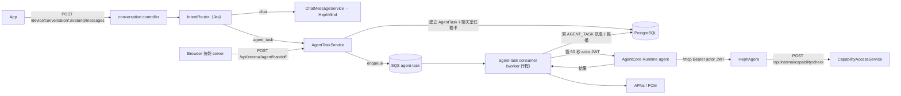

# 對話 agent 執行計劃書（建在 `ai_family_backend` 上）

> 依據：[92 架構設計](./README.md)（含思源「2 落差討論」G01–G22 的決策）＋ `~/WS/ai_family_backend` 現況（以 codegraph 與讀碼確認，2026-10-05）。
>
> 範圍：**後端（BFF）為主**，同時列出 agent 容器、Browser 技能 server、HephAgora、App 的依賴與介面，讓各階段能對得起來。
>
> 寫法：「現況」是讀碼確認的事實，附檔案路徑；「建議」是本文件補的做法；工時是**粗估（人天）**，未經團隊確認；「待確認」是讀碼找不到答案、需要人回答的點。

## 一、目標與時程

| 里程碑 | 日期 | 本文件對應階段 | 交付 |
|---|---|---|---|
| M1 | 10/12 | 階段 0 | 調研結案、前置完成、後端設計定稿 |
| M2 | 10/19 | 階段 1 | **第一張卡**：白名單使用者從聊天室發起任務，agent 讀 Google 行事曆，結果卡＋推播回到 App |
| M3 | 10/27 | 階段 2 | S1–S3 跑通（找地方、排行程、研究比較），受控網站 Playwright，Jev 意圖分流，權益回查 |
| M4 | 11/2 | 階段 3 | S4 接手登入、驗收量測、20 人內測 Go／No-go |

第一階段**不做**（G18）：Nova Act、持久停等（checkpoint／resume）、定時任務、跨任務記憶、額度預留結算、Android renderer、A2UI P1／P2、把工具呼叫從 HephMind 拿掉。

## 二、後端現況盤點（決定了怎麼拆）

| 主題 | 現況（檔案） | 對執行計劃的意義 |
|---|---|---|
| 分層 | Router → Controller → Service → Repository → Prisma；型別一律放 `src/types/*.types.ts`；service 依領域開資料夾、通道放檔名前綴；API 改動要同步 `swagger/paths/` 並讓 `bun run swagger:generate` 通過（`backend/CLAUDE.md`） | 新功能照此分層；每個新端點都要有 validator、swagger、測試 |
| Worker | 單一 replica 的 `media-worker` 行程跑全部 consumer＋sweeper（`src/worker/index.ts`）；新 job＝`jobs/<name>/` ＋**獨立 queue＋獨立 `runConsumer`**；`runConsumer` 需 `maxConcurrent`，要跑數十秒到數分鐘的 job 要傳 `heartbeatIntervalMs`；`totalWorkerLoops` 要加新 consumer 的項、必要時調 `SQS_MAX_SOCKETS`（`src/worker/CLAUDE.md`） | `agent-task` 照 `avatar-tag-generation`／`alarm-call` 的寫法；本文件不拆微服務（G05） |
| Queue 設定 | `SQS_QUEUE_ENV_NAMES`、`SqsConfig.queues`（`src/types/config.types.ts:180`）、`sqsConfig`（`src/configs/sqs.ts`）；producer 在 `services/media-worker-queue.service.ts`；`chatImageGen` 是「選配 queue、沒設就不啟動 consumer」的先例 | agent-task queue 比照 `chatImageGen`：選配＋功能旗標，沒部署的環境不會被擋住 |
| Sweeper | `runSweeper`（`worker/runtime/sweeper-loop.ts`）統一 root span、錯誤吞掉、shutdown 檢查；每個 sweeper 在 `worker/CLAUDE.md` 的表裡都要寫多副本安全性 | agent-task sweeper 要在該表補一列 |
| Actor JWT | `signActorJwt`（`src/services/hephagora-actor.service.ts`）：RS256、TTL 上限由 `configs/hephagora.ts` 的 `actorJwtMaxTtlSec` 限 60 秒、`act.sub=consumer:<id>`；`ActorJwtClaims`（`src/types/hephagora.types.ts`） | 直接重用；G16 的「每次工具呼叫前換新」＝多次呼叫 `signActorJwt` |
| 現有 HephMind 身分票 | `hephmind-chat.service.ts` 的 `buildActorHeader`：優先用 HA 的 opaque session（30 分鐘滑動，`hephagora-session.service.ts`），換不到才退回 60 秒 JWT | **與 G16 的方向不同**：agent 路徑要用 60 秒 JWT，不用 session token。見「風險」 |
| 能力購買／試用／開關 | `DeviceCapabilityPurchaseService`、`DeviceCapabilityTrialService`、`DeviceCapabilityToggleService`；`isEffectivelyUnlocked`（`src/types/capability-app.types.ts:42`）；聊天掛載在 `chat-capability.service.ts`；規則：有試用必須先試用，直接購買回 409 | **找不到名為 `CapabilityAccessService` 的類別**，要新增一個，把「有效解鎖＋期間窗＋夥伴適用＋開關」包成一次查詢給 HephAgora 回查 |
| 機器對機器路由 | `routes/internal/*`，用 `requireServiceToken`（`x-service-token`）驗證（`routes/internal/activity.routes.ts`） | HephAgora 回查、Browser 技能 server 通知，都放 `routes/internal/`，不開到 device 路由 |
| 聊天流程 | `POST /device/conversation/:avatarId/messages` → `conversationController.sendMessageStream` → `ChatMessageService.sendStreaming`（`services/chat-message.service.ts:80`）→ HephMind SSE（`hephmind-chat.service.ts`、`hephmind-chat-stream-reader.service.ts`） | 意圖分流（Jev）插在進 `sendStreaming` 之前；判成 agent 任務的不送 HephMind（避免重複執行，G11） |
| 推播 | `apns-push.service.ts`（目前只看到 `sendVoipPush`）、`fcm-push.service.ts`、`device-notification.service.ts` | **待確認**：iOS 一般 alert 推播有沒有現成方法；沒有就補一個 |
| 名稱撞名 | `routes/device/task.routes.ts` 與 `Task`／`UserTask` 是活動任務 | 新功能一律 `AgentTask`／`agent-task`／`/device/agent/*`（G05） |
| Message 結構 | `model Message`（`prisma/schema.prisma:1759`）；`Conversation` 為多型（DIRECT／GROUP／STORY） | **待確認**：`Message` 是否已有可放 `meta.kind` 的欄位；沒有就要 migration |
| Jev | backend 內沒找到 | **待確認**：Jev 在哪裡、怎麼呼叫（HTTP 服務，或從 hephclaw POC 移植 adapter） |
| 測試 | Cucumber（`tests/features*`、`step-definitions*`）、Jest unit、`tests/doubles/`（有 `hephagora-catalog.double.ts`）、Testcontainers＋Supertest | 每階段的驗收標準都對應到可跑的測試 |

## 三、目標設計（在 backend 內）

**新增的後端元件**（路徑為建議）：

| 元件 | 位置 | 責任 |
|---|---|---|
| `AgentTask` 資料表（含狀態、attempt、租約、`runtimeSessionId`、結果、錯誤） | `prisma/schema.prisma` ＋ migration（照 `/add-db-migration`） | 任務狀態機：`PENDING → RUNNING → WAITING_USER → SUCCEEDED／FAILED／CANCELLED／EXPIRED` |
| `AgentRuntimeSession` 對照表 | 同上 | 使用者 ↔ Runtime session；供預喚醒、閒置後 `StopRuntimeSession`、成本分攤 |
| `services/agent-task/`（`device-agent-task.service.ts`、`agent-task.service.ts` 等） | `src/services/agent-task/` | 建立任務、查詢、取消、狀態轉移、寫任務卡訊息 |
| `repository/agent-task.repository.ts` | `src/repository/` | 只有這層碰 Prisma；狀態轉移用條件式 UPDATE（CAS），不持有長交易 |
| `IntentRouterService` | `src/services/agent-task/intent-router.service.ts` | 呼叫 Jev，輸出 `chat／quick_answer／agent_task／clarify`；信心不足或逾時當 `chat` |
| `AgentCoreRuntimeService` | `src/services/agent-task/agentcore-runtime.service.ts` | `InvokeAgentRuntime`、`StopRuntimeSession`；session ID 以使用者 ID 開頭；**BFF 的角色不得有 `InvokeAgentRuntimeCommand`**（WP5） |
| `CapabilityAccessService` | `src/services/capability/capability-access.service.ts` | 一次回答「這位使用者現在能不能用這個能力」，供 HephAgora 回查；內測旗標開啟時全開，但流程照走 |
| `worker/jobs/agent-task/` ＋ `configs/agent-task-worker.ts` | `src/worker/jobs/`、`src/configs/` | consumer handler（Zod 驗 payload → 認領 → 呼叫 Runtime → 寫結果）；`maxConcurrent`、逾時等旋鈕集中在 config |
| `worker/runtime/agent-task-sweeper.ts` | `src/worker/runtime/` | 收掉卡住的 RUNNING（租約過期）、超過 5 分鐘的 WAITING_USER；重投未入列的 PENDING |
| device 路由 `/device/agent/*` | `src/routes/device/agent-task.routes.ts` | 任務列表、詳情、取消、預喚醒；全部走 `requireMobileApiKey`＋`requireAppUserAccessToken` |
| internal 路由 | `src/routes/internal/capability.routes.ts`、`agent.routes.ts` | HephAgora 權益回查；Browser 技能 server 的接手通知；全部走 `requireServiceToken` |

## 四、執行階段與驗收標準

### 階段 0：前置與設計定稿（10/5–10/12，M1）

**目的**：把會卡住後面階段的待確認點清掉，不寫功能程式。

| # | 工作 | 負責 | 粗估 |
|---|---|---|---|
| 0.1 | 確認 `Message` 能否放 `meta.kind`；確認 Jev 的位置與呼叫方式；確認 iOS alert 推播現況 | 後端 | 1 天 |
| 0.2 | 寫 ADR（`docs/adr/`）：任務協調放 BFF（G05）、`AgentTask` 命名與狀態機、與 `Task` 的分界 | 後端 | 1 天 |
| 0.3 | 定 `AgentTask`／`AgentRuntimeSession` 的 schema 草案與 payload 型別（Zod） | 後端 | 1 天 |
| 0.4 | 建 repo `hephai/faiya-agent`（`runtime/`、`browser-skill/`），把 `skill-gating/agent/main.py`、`takeover/browser_skill.py` 搬入當起點 | Kais | 1 天 |
| 0.5 | 清 HephAgora `wp2/skill-gating` 分支（`cookies.txt`、`.codegraph/`、`src/wp2/todo.ts`），並規劃把授權改成回查 | Kais | 0.5 天 |
| 0.6 | 確認 Haiku 4.5 EOL（≥ 10/16）與主模型 | Kais | 0.5 天 |
| 0.7 | 對齊 Roman（G02／G04／G08／G15）、Kais（G03／G09／G11／G21）、David（G10／G14／G18／G19） | Josh／Kais | 持續 |
| 0.8 | iOS：依 Faiya design system 估 P0 批次工時 | Josh | 依 G08 |
| 0.9 | 設計 actor JWT 長任務換新的機制（見「風險」R1），定案後寫進 ADR | 後端＋Kais | 1 天 |

**驗收標準**
- [ ] 0.1 的三個待確認點各有書面答案（寫進 ADR 或本文件）。
- [ ] ADR 合併進 `docs/adr/`，內含狀態機圖與命名規則。
- [ ] `faiya-agent` repo 存在，`runtime/` 在本機能對 HephAgora `/mcp` 完成一次 `tools/list`。
- [ ] `wp2/skill-gating` 分支 `git ls-files` 找不到 `cookies.txt`、`.codegraph/`、`src/wp2/todo.ts`。
- [ ] Haiku 4.5 EOL 與主模型有結論。
- [ ] 思源 G01–G22「還要對齊」的人都已勾選或有書面回覆。

### 階段 1：垂直切片——第一張卡（10/12–10/19，M2）

**目的**：一條最薄的完整鏈路：白名單使用者發起 → 任務入列 → agent 在 Runtime 跑 → 讀行事曆 → 結果卡＋推播。只開 iOS、白名單內部使用者。

| # | 工作 | 後端位置 | 粗估 |
|---|---|---|---|
| 1.1 | `AgentTask`、`AgentRuntimeSession` migration、repository（CAS 狀態轉移） | `prisma/`、`repository/` | 2 天 |
| 1.2 | queue 設定：`SQS_QUEUE_ENV_NAMES.agentTask`、`SqsConfig.queues.agentTask`、`MediaWorkerQueueService.enqueueAgentTask`、`elasticmq.conf`、Terraform queue（VisibilityTimeout、DLQ、`maxReceiveCount`） | `configs/sqs.ts`、`types/config.types.ts`、`services/media-worker-queue.service.ts` | 1 天 |
| 1.3 | `jobs/agent-task/`：Zod payload、認領、呼叫 Runtime、寫結果；傳 `heartbeatIntervalMs`；`index.ts` 加 consumer、`totalWorkerLoops` 加一項；`configs/agent-task-worker.ts` | `src/worker/` | 3 天 |
| 1.4 | `AgentCoreRuntimeService`：`InvokeAgentRuntime`（payload 帶 actor JWT）、`StopRuntimeSession`、session ID 規則；本機用 double | `services/agent-task/` | 2 天 |
| 1.5 | `/device/agent/*`：建立（暫時由 App 明確發起，意圖分流在階段 2）、列表、詳情、取消、預喚醒；validator＋swagger | `routes/device/`、`controllers/`、`validators/device/`、`swagger/paths/` | 3 天 |
| 1.6 | 聊天室任務卡：寫 `meta.kind=AGENT_TASK` 的訊息、完成後更新；推播（APNs alert，必要時補方法）、通知落在任務詳情頁 | `services/agent-task/`、`apns-push.service.ts` | 2 天 |
| 1.7 | `CapabilityAccessService` ＋ `POST /api/internal/capability/check`（先只回「是否可用」，內測旗標全開），p95 目標寫進測試 | `services/capability/`、`routes/internal/` | 2 天 |
| 1.8 | sweeper：卡住的 RUNNING、未入列的 PENDING；在 `worker/CLAUDE.md` 的多副本表補一列 | `worker/runtime/` | 1 天 |
| 1.9 | HephAgora：`/mcp` 的授權改成呼叫 1.7 回查（fail closed、逾時 300 ms）；Google 行事曆讀取一個工具 | HephAgora repo | 3 天 |
| 1.10 | `faiya-agent/runtime/`：Strands agent，每個任務各一個 Agent 實例，handler async，`/ping` 在長任務時回 `HealthyBusy` | `faiya-agent` | 3 天 |
| 1.11 | Terraform：Runtime、VPC（無 NAT）、必要 VPC endpoint、IAM（execution role 無 Browser 權限）、BFF 角色只有 `InvokeAgentRuntime` | `aws-terraform-template`（main） | 3 天 |
| 1.12 | 功能旗標（沿用 `feature-flag.service.ts`）：總開關＋白名單；旗標關閉時整條路徑 no-op | `services/feature-flag.service.ts` | 0.5 天 |

**驗收標準**
- [ ] **端到端**：白名單使用者在 iOS 發起「看我明天的行事曆」，≤ 30 秒內聊天室出現「助理」任務卡並更新為結果，收到推播，點開落在任務詳情頁。連續 10 次成功。
- [ ] **隔離**：用使用者 A 的 token 查／取消使用者 B 的任務，一律 404；agent 呼叫 HephAgora 時只拿得到 A 的行事曆（跨使用者外洩 0，附測試）。
- [ ] **授權**：未解鎖的使用者 `tools/list` 看不到該工具、`tools/call` 回 403；`/internal/capability/check` 逾時（模擬 > 300 ms）時 HephAgora 拒絕並回可重試錯誤，不放行、也不當成「未購買」。
- [ ] **效能**：`/internal/capability/check` p95 ≤ 100 ms（本機 Testcontainers 以 1,000 次量測；staging 再量一次）。
- [ ] **JWT**：Runtime 收到的 actor JWT `exp - iat ≤ 60`；同一任務內兩次工具呼叫使用不同 `jti`。
- [ ] **Worker**：consumer 處理中殺掉行程，訊息在 visibility timeout 後被重投且任務不重複執行（冪等）；超過 `maxReceiveCount` 進 DLQ 並把任務標 `FAILED`。
- [ ] **Sweeper**：人為讓一筆 RUNNING 租約過期，下一輪被標為 `FAILED`（帶原因）。
- [ ] **隔離網路**：Runtime 在無 NAT 的 VPC 內，打外網失敗、打 HephAgora 成功。
- [ ] **回歸**：`tests/` 既有 Cucumber／Jest 全綠；`bun run swagger:generate` 通過；ESLint 與 `tsc` 無新增錯誤。
- [ ] 旗標關閉時，既有聊天流程行為與效能不變（`sendStreaming` 的既有測試全綠）。

### 階段 2：意圖分流與 S1–S3（10/19–10/27，M3）

**目的**：把任務入口從「App 明確發起」換成「聊天室一句話」，補上受控網站與權益狀態，跑通 S1 找地方、S2 排行程、S3 研究比較。

| # | 工作 | 位置 | 粗估 |
|---|---|---|---|
| 2.1 | `IntentRouterService`（Jev）：插在 `sendMessageStream` 進 `sendStreaming` 之前；輸出 `chat／quick_answer／agent_task／clarify`；信心不足或逾時當 `chat`；判成 agent 任務的訊息**不送 HephMind** | `services/agent-task/`、`controllers/device/conversation.controller.ts` | 4 天 |
| 2.2 | 200 句評測集與評測腳本（`scripts/llm-evals/` 已有先例） | `scripts/llm-evals/` | 2 天 |
| 2.3 | Browser 技能 server：受控網站清單＋每站一支 Playwright 固定腳本＋改版監控（失敗率升高告警）；MANAGED 政策檔、自訂 Browser；獨立 IAM 角色；lease 與操作守門 | `faiya-agent/browser-skill/` | 6 天 |
| 2.4 | HephAgora 把 `actor` 傳給 mcp_server binding（約 5 行），讓 Browser 技能 server 知道要通知誰（92「六」待決） | HephAgora | 1 天 |
| 2.5 | 逐項解鎖：`CapabilityAccessService` 補完整規則（有效解鎖、期間窗、夥伴適用、開關）；內測旗標全開但流程照走；CapabilityCard 只下發當下合法的一個動作（有試用就只出「試用」） | `services/capability/`、`routes/device/capability.routes.ts` | 3 天 |
| 2.6 | 任務詳情的補資料：`WAITING_USER` 狀態與回答端點（單次 act 內等待，上限 5 分鐘） | `services/agent-task/` | 3 天 |
| 2.7 | ApprovalCard：有副作用的動作（寫入行事曆、送出表單）先出確認，回答前不執行 | `services/agent-task/`、agent 端 | 2 天 |
| 2.8 | 成本與用量：依 session 加總 `USAGE_LOGS`，寫入 `AgentTask` 的成本欄位或報表 | `services/agent-task/` | 2 天 |
| 2.9 | agent 端：S1–S3 的工具與提示詞；每任務一個 Agent 實例；並行任務不互相污染 | `faiya-agent/runtime/` | 5 天 |

**驗收標準**
- [ ] **意圖**：200 句評測集準確率 ≥ 90%、誤觸發（把聊天判成任務）≤ 3%；Jev 逾時或信心不足時一律當一般聊天且使用者不報錯。
- [ ] **不重複執行**：判成 agent 任務的訊息，HephMind 沒收到該則（以 double 斷言呼叫次數 0）。
- [ ] **S1／S2／S3**：各跑 30 次，成功率 ≥ 80%；失敗逐次記錄原因；首句 p90 ≤ 1.5 秒（預喚醒後）。
- [ ] **受控網站**：白名單外網址回 `ERR_BLOCKED_BY_ADMINISTRATOR`；agent 對話、HephAgora log、帳本、BFF log 裡搜不到 Live View URL（附搜尋腳本結果）。
- [ ] **權益**：未解鎖／試用過期／出窗／夥伴不適用，各有一個測試且回對應訊息；有試用的能力直接購買回 409；內測旗標開啟時全開、關閉時恢復檢查。
- [ ] **補資料**：`WAITING_USER` 超過 5 分鐘被 sweeper 結束並回明確狀態；等待期間不持有 DB 交易或連線（以連線池監控斷言）。
- [ ] **確認卡**：有副作用的動作在使用者確認前零執行（附測試）；一般查詢不出現確認。
- [ ] **並行**：同一使用者同時兩個任務都完成，兩者輸出不串（對照 468–592 ms 的實測量級）。
- [ ] **回歸**：同階段 1 的回歸項。

### 階段 3：接手登入、硬化與驗收（10/27–11/2，M4）

**目的**：S4 接手登入、補齊穩定性與觀測、做完 Go／No-go 需要的量測。

| # | 工作 | 位置 | 粗估 |
|---|---|---|---|
| 3.1 | 接手流程：Browser 技能 server → `POST /api/internal/agent/handoff`（service token）→ BFF 推播 viewer 連結；使用者交還 → 任務繼續；URL 不經 agent | `routes/internal/agent.routes.ts`、`services/agent-task/` | 4 天 |
| 3.2 | 5 分鐘上限：binding、agent HTTP、SQS visibility、Runtime 逾時一併調到 > 5 分鐘；逾時回 `user_did_not_complete_login`，server release 並 `StopBrowserSession` | 各處 config | 2 天 |
| 3.3 | `UpdateBrowserStream` 停／啟 automation 接上主路徑；`PasswordManagerEnabled: false` | `browser-skill/` | 2 天 |
| 3.4 | 觀測：`AgentTask` 的 root span、狀態轉移 log、DLQ 告警、成本儀表；依 `agent.name` 過濾 `USAGE_LOGS` | `utils/telemetry`、Terraform | 2 天 |
| 3.5 | 壓測：20 人並行、尖峰同時發起；看 Prisma 連線池、SQS socket、Runtime 配額（`scripts/load/`、`docker-compose.loadtest.yml` 已有先例） | `scripts/load/` | 2 天 |
| 3.6 | 安全檢查：跨使用者外洩測試、execution role 無 Browser 權限、BFF 角色無 `InvokeAgentRuntimeCommand`、actor JWT 過期行為 | `tests/` | 2 天 |
| 3.7 | Runbook：旗標開關、DLQ 處理、卡住任務處理、Runtime session 清理、回滾 | `docs/` | 1 天 |
| 3.8 | 新手測試（5 人至少 4 人完成）與 Go／No-go 報告 | 全員 | 2 天 |

**驗收標準**
- [ ] **S4 接手登入**：30 次，成功率 ≥ 70%（失敗逐次記錄原因）；偵測登入頁到推播 ≤ 10 秒；交還後 ≤ 5 秒拿到結果；接手時輸入的帳密沒有被保存（檢查 Browser profile 與 log）。
- [ ] **逾時**：使用者不交還時，5 分鐘內任務收掉、Browser session 停掉、回明確狀態；全程 `StopBrowserSession` 都有被呼叫（以 Browser 的 session 列表對帳為 0 殘留）。
- [ ] **成本**：每任務成本在上限內（上限數值於階段 2 的 2.8 量測後由 David、Kais 定）。
- [ ] **壓測**：20 人並行下，API p95 不劣化超過基準的 20%；沒有 Prisma 連線池耗盡；SQS 無「已處理卻重投」。
- [ ] **安全**：跨使用者外洩 0；execution role 呼叫 `StartBrowserSession` 被拒；BFF 角色呼叫 `InvokeAgentRuntimeCommand` 被拒。
- [ ] **內測就緒**：旗標可在 1 分鐘內全關；Runbook 的「卡住任務處理」由非作者實際演練一次。
- [ ] **Go／No-go**：S1–S3 ≥ 80%、S4 ≥ 70%、意圖準確率 ≥ 90%／誤觸發 ≤ 3%、首句 p90 ≤ 1.5 秒、跨使用者外洩 0、新手 5 人至少 4 人完成——**全部達標才 Go**；未達標的項目列出原因與補救日期。

## 五、跨階段的規則

- **每個 PR 的完成定義**：型別在 `src/types/`、validator、swagger 同步、Cucumber／Jest 有對應案例、`tsc`＋ESLint＋`ts-guard` 通過、`worker/CLAUDE.md` 的檔案樹與多副本表（若動到 worker）已更新。
- **新資料表一律走 `/add-db-migration`**，不手改 migration。
- **旗標優先**：每一階段的新行為都在旗標後面，旗標關閉時既有聊天與購買流程零影響。
- **等待期間不持有 DB 交易或連線**（G05）；`agent-task` queue 有獨立 `maxConcurrent`，不和其他 job 搶資源。
- **拆服務的時機**（G05）：任務量明顯影響主業務、要做 checkpoint／resume、有專人負責時才拆；現在在 `worker/index.ts` 為 agent-task consumer 留「只啟動某些 consumer」的環境變數開關，日後拆成獨立 worker deployment 時不用改程式。

## 六、風險與待決

| # | 風險／待決 | 影響 | 建議 | 何時定 |
|---|---|---|---|---|
| R1 | **actor JWT 長任務換新**：G16 定「60 秒、BFF 每次工具呼叫前換新」，但 agent 在 Runtime 裡直接連 HephAgora `/mcp`，BFF 不在呼叫路徑上。現有 HephMind 路徑用 30 分鐘 session token（`buildActorHeader`），與 G16 方向不同 | 做錯會放寬「token 外洩最大損害＝60 秒」的假設，或長任務中途 401 | 選項：(a) agent 每次工具呼叫前向 BFF 要新 JWT（BFF 提供受 service token 保護的簽發端點）；(b) 工具呼叫由 BFF 轉送。**建議 (a)**，並在 ADR 寫明 agent 路徑不使用 session token | 階段 0（0.9） |
| R2 | `CapabilityAccessService` 回查成為每次 `tools/list`／`tools/call` 的相依，延遲預算只有 100 ms | 回查變慢會拖垮所有技能呼叫 | 單一索引查詢（`UserCapabilityUnlock` 的 unique 鍵）；不打外部服務；可加短 TTL 快取，但快取會讓「剛購買／剛過期」延遲，**建議第一版不快取** | 階段 1 量測後 |
| R3 | `media-worker` 是單 replica 且共用連線池／socket；agent-task 每則等數分鐘 | 擠壓既有 job | 獨立 `maxConcurrent`、`totalWorkerLoops` 加項、`SQS_MAX_SOCKETS` 檢查；壓測不過就用 env 開關拆獨立 worker | 階段 3（3.5） |
| R4 | Jev 位置與可控性（Kais 提過可控性不高） | 意圖準確率可能達不到 90% | 評測沒過門檻的退路在 M2 前跟 Kais 定（G11 的「建議」） | 階段 1 結束前 |
| R5 | iOS 的 P0 批次工時（43 項）可能吃掉 11/2 | App 端沒完成則後端驗收無法端到端 | 階段 0 的 0.8 先估；後端用 `faiya-tester`（repo 內已有測試 App）當替代驗收端 | 階段 0 |
| R6 | 接手登入只在 iOS 模擬器驗過；真機、CAPTCHA、OTP 沒測 | S4 達不到 70% | 階段 2 就用真機試跑；失敗的網站移出受控清單 | 階段 2 |
| R7 | Haiku 4.5 EOL ≥ 10/16 | 模型下線 | 模型是設定值；階段 0 確認後定主模型 | 階段 0（0.6） |
| R8 | 工時為粗估，未含 App、HephAgora、Terraform 的等待與 review 時間 | 里程碑滑動 | M2 之後依實際速度重估 M3、M4；範圍可從「不做清單」之外再砍的是 2.8（成本儀表）與 3.4 的儀表部分 | 每個里程碑 |

## 七、各階段產出總表

| 階段 | 交付物 | 驗收一句話 |
|---|---|---|
| 0 | ADR、schema 草案、`faiya-agent` repo、清好的 HephAgora 分支 | 後面階段不再被待確認項卡住 |
| 1 | `AgentTask` 全鏈路、`CapabilityAccessService`、Runtime 與 Terraform | 白名單使用者連續 10 次拿到行事曆結果卡與推播，且隔離與授權測試全過 |
| 2 | 意圖分流、受控網站、逐項解鎖、補資料、確認卡 | S1–S3 各 30 次 ≥ 80%，意圖 ≥ 90%／誤觸發 ≤ 3% |
| 3 | 接手登入、觀測、壓測、Runbook、Go／No-go 報告 | 全部指標達標才 Go |
